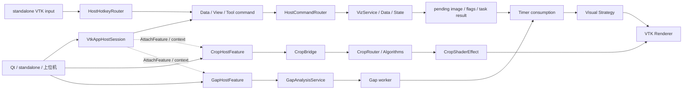
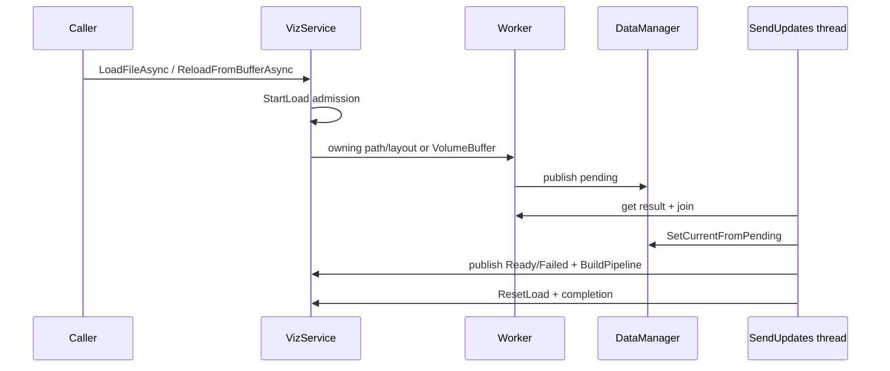
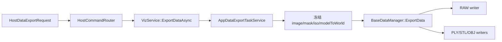
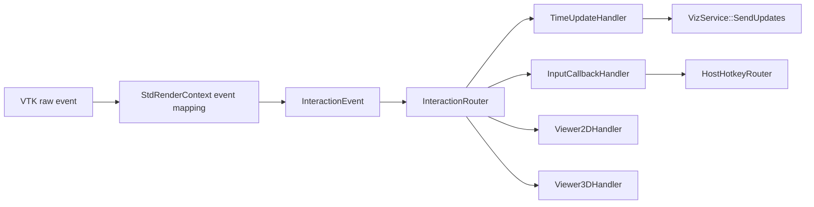
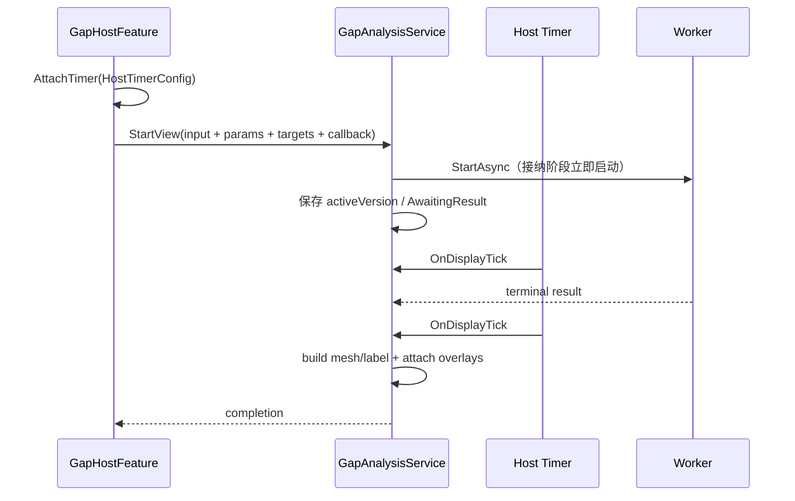

# MVVCVTK 架构审查与设计记录

## 1. 阅读入口

| 项目 | 内容 |
| --- | --- |
| 用途 | 当前架构事实、边界、主链与风险索引 |
| 源码基线 | 2026-07-28 当前工作树 |
| 最近核验 | 2026-07-28 |
| 主工程 | `MVVCVTK/MVVCVTK.vcxproj` |
| 默认验证 | `Debug|x64` / `Release|x64`，不主动验证 32 位 |
| 非 Qt 测试 | `test/MVVCVTK.Tests.sln` 中 3 个工程 |
| QtHost 测试 | `test/QtHost` 下 4 个独立 `.vcxproj` |
| Host 细节 | [HostLayer.md](HostLayer.md) |
| Crop 细节 | [OrthogonalCropAlgorithmDesign.md](OrthogonalCropAlgorithmDesign.md) |
| Qt 接入 | [QtIntegrationGuide.md](QtIntegrationGuide.md) |

`.graphify/graph.json` 只能在增量状态与当前工作树一致时作为语义证据；`stale=false` 不是
充分条件。本轮在代码与文档核验后执行 `hook-rebuild`，下述接口结论仍以源码为最终真源。

## 2. 分层

| 层 | 核心组件 | 负责 | 不负责 |
| --- | --- | --- | --- |
| L0 宿主 | standalone `main`、Qt/上位机 adapter | 窗口与外部事件循环 | feature 业务 |
| L1 Host | `VtkAppHostSession`、ViewSet、Router、`HostFeature`、HotkeyRouter | 组合、目标解析、主体命令分发、Feature 上下文与 adapter 生命周期 | Feature 业务与算法实现 |
| L2 App | `VizService`、load/export task service | 任务编排、消费线程提交、策略选择 | widget/算法 |
| L3 State/Data | `SharedInteractionState`、DataManager | 状态真源、flags、versioned current/pending | renderer |
| L4 Interaction | `StdRenderContext`、`InteractionRouter`、handlers | VTK 事件映射、优先级与传播 | 重型算法 |
| L5 Feature | `CropHostFeature` / `CropBridge`、`GapHostFeature` / `GapAnalysisService` | 独立请求协议、会话状态、结果生命周期 | Host 窗口所有权 |
| L6 Algorithm | Crop/Gap algorithms | 值对象输入、纯计算、result/failure | renderer/widget |
| L7 Display | Strategy、`CropShaderEffect`、Gap overlay strategy | VTK pipeline、prop、shader、attach/detach | 重新执行业务算法 |

## 3. 总链路



## 4. Host 协议

### 4.1 顶层 command

| alternative | Request | owner |
| --- | --- | --- |
| `HostDataCommand` | `HostDataRequest` | primary/slice `VizService` |
| `HostViewCommand` | `HostViewRequest` | target `VizService`/context |
| `HostToolCommand` | `HostToolRequest` | target context |

`HostCommand` 只包含 `monostate` 与上表三类主体 alternative。Crop/Gap 不进入主体 variant，分别由 `CropHostFeature::SendRequest()` 与 `GapHostFeature::SendRequest()` 接收自己的 typed request。不存在嵌套 `HostFeatureCommand`，也不存在 `HostLoadCommand`、`HostReloadCommand`、`HostExportCommand`、`HostExitCommand`。

`VtkAppHostSession::SendData/SendView/SendTool` 只是对外 typed facade：三者都封装
`HostCommand` 后进入 `VtkAppHostSession::Impl::SendCommand()`。Host 内部唯一主体分发出口是
`HostCommandRouter::DispatchCommand(HostCommand)`；Qt、main 和 Feature 均不持有 Router。

### 4.2 Session

`HostSessionConfig` 包含 `renderViews`，以及 standalone 导出热键使用的
`dataExportRequest/sliceExportRequest` 缺省请求。Qt 显式 `SendData()` 不经过这两份配置。
Session 的 `BuildSession()` 在空拓扑时返回 `false`，且不渲染；底层
`HostRenderViewSet::Build()` 本身允许空配置，空拓扑门禁属于 Session。`Start()` 才执行
`SendRenderAll()` 并进入 standalone event loop。主体运行期输入经
`SendData/SendView/SendTool`；Timer/Hotkey 分别用 `AttachTimer`、`AttachHotkeys`，Feature
由 composition root 构造并用 `AttachFeature` 注册。

### 4.3 View Set 事务

`HostViewSetRequest` 的 mode、material/preset、opacity、scalar TF/preset、iso、background、
spacing、WW/WC、volume quality、gradient opacity、denoise、cursor、元素显隐与方向轴显隐
先统一解析为候选。任一字段
非法或与目标 mode 能力不匹配时零 setter；合法候选先提交唯一可能报告业务失败的 spacing
事务，再写入其余已验证状态。material 与独立 opacity 在候选阶段合并为一次
`MaterialParams` 更新；material preset 不能和 numeric material/opacity 同时出现，scalar TF
preset 不能和显式 TF 同时出现。

`ResetCamera` 继续属于同一 `HostViewRequest` action 轴，严格搭配
`HostViewResetRequest` 并只作用目标 context；方向轴切换与相机复位只标脏既有目标
service，不新增 Qt facade 或 camera 状态 owner。

## 5. State 与 Data

### 5.1 状态真源

| 主题 | 不变量 |
| --- | --- |
| 共享状态 | `SharedInteractionState` 是应用状态真源 |
| 差异发布 | setter same-value 不发布，变化转换为 `UpdateFlags` |
| 广播 | broadcaster 只传 flags，consumer 再取稳定快照 |
| callback | 锁外执行，允许重入 |
| VTK | worker 不 attach/detach prop，不重建 renderer pipeline |

共享状态包含多个正交轴，不能把“当前视图状态”理解成每个窗口各持一份：

| 状态轴 | 真源/默认 | 消费边界 |
| --- | --- | --- |
| WW/WC | session 唯一 `SharedInteractionState`，默认 400/40 | 三张 Slice 共用；3D 当前不消费 |
| Cursor | world position + source axis | 三张 Slice 联动；3D 交互可写入 |
| Visibility | `Planes3D | Crosshair | Ruler` bit mask | 各 Strategy 只消费自己的 bit |
| Material / scalar TF / percentile intent | session 唯一 `SharedInteractionState` | Volume、Iso 与 Composite 消费；preset 解析结果按 DataVersion 接纳 |
| Interaction | `SharedInteractionState` 的 active source 集合 | 只在空/非空边界发布聚合状态 |
| Volume quality / gradient opacity / denoise | 目标 `VizService::Impl` | 仅目标 Volume/CompositeVolume 策略消费 |
| Orientation axes | 每个 `StdRenderContext` 的 widget | 不是 SharedState；Host 支持建窗初值与运行期 Set |

File/Reload 成功会按新数据范围重置 WW/WC，并把 cursor 放到新体数据 world 中心；失败
保留旧状态。Qt 通过 `HostViewSetRequest` 写 cursor、共享 visibility bit 和目标方向轴，
通过 `HostViewResetRequest` 复位目标相机，不直接取得内部 service/context。

### 5.2 Image transaction

DataManager 维护 current 与 pending。File/Reload worker 只准备 pending；消费线程在 future ready、worker join 后执行 `SetCurrentFromPending`，再发布终态、重建 pipeline、释放 admission 和交付 completion。



RAW load 允许请求提供三轴正 dimensions；只有 `.raw` 且 dimensions 恰为 `{0,0,0}` 时才从文件名末尾推断。文件大小必须与 layout 精确相等。

### 5.3 统一 Data Export

主体只暴露 `HostDataAction::ExportData + HostDataExportRequest`。`outputPath` 是 UTF-8
输出目录；`HostDataExportFormat` 是 Host 唯一格式基元，当前为
`Raw/Ply/Stl/Obj`。显式格式在 Router 收敛为规范小写后缀；格式缺省时，Volume 模式推断
RAW，IsoSurface 模式推断 PLY，slice 模式不能推断体或网格格式。



App/Task 只冻结参数并编排异步任务，Data 层才选择 writer、创建目录和拼接文件名。统一文件名
为 `<dimX>x<dimY>x<dimZ>_transform<extension>`。RAW 输出变换后的 float32 体数据；
PLY/STL/OBJ 从同一冻结 image、current iso 与 validity mask 构造等值面，烘焙
model-to-world 后写出。调用方不得传具体文件名，也不得让 Host/App 重复解释格式。

### 5.4 Crop 物化的第二提交入口

Crop Export 物化不走 App worker/mailbox：`CropHostFeature` 从 root snapshot 与历史前缀构建发布任务，经 Host 提供的 expected-snapshot writer 执行 pending -> current -> 各 view `SendReloadUpdate()` -> shared ready -> completion。它与普通 File/Reload 共用 admission 和 DataManager，但不把 Crop command 耦合进主体 Router。

若 current 已提交后某个 view pipeline rebuild 或共享 Ready 发布失败，writer 先以 promoted version 做 CAS 语义恢复，再重建已接受新 current 的 view，最后发布 ReloadFailed/ResetLoad。恢复会复用旧 immutable snapshot 的 image/metadata，但发布新 version，因此 version 始终单调；CAS 失败表示已有更晚事务，禁止覆盖该 current。

已更新 view 的补偿严格早于 ReloadFailed 广播；补偿失败会记录 promoted version，并仍保持 ReloadFailed 终态。CAS 失败时已更新 view 会重建到当时最新 current，避免停留在失败候选。

## 6. Interaction 与 Render



`FirstMatch` 用于互斥鼠标/键盘输入，首个 `isHandled` 停止；Timer 使用 `Broadcast`。`isHandled` 与 `isPropagationStopped` 是两条独立语义轴。

Strategy 负责具体 VTK pipeline 与 props；`VizService` 只选择/切换 Strategy、设置输入与同步状态。新增 VizMode 必须接入唯一策略映射并增加构建测试。

交互状态使用 `(ownerId, channelId)` source 聚合；Viewer 与 Feature 只清理自己创建的
source，最后一个 source 退出后才恢复低频刷新。`VizService::SetStrategyState()` 是
`DesiredUpdateRate` 唯一写点。Volume 保持稳定 GPU mapper，并把质量档位、梯度不透明度
与显示前 denoise 物化为 producer/property 派生状态；这些显示设置不写回 DataManager，
也不改变 Crop/Gap snapshot。Camera source 因当前 observer 正常、取消、切换与析构路径
尚无可证明的对称屏障，保持未实现。

Feature 活动状态是参与 view 的局部派生输入：Feature 先用只读
`HostRenderViewSet` 解析精确 `InteractiveService` 集合，再通过
`HostFeatureContext::setActiveViews()` 上报；`HostRenderViewSet` 验证服务归属，并按
opaque feature id 聚合后投递到各 `VizService`。活动期间 producer 始终锁定
Quality 766，mapper 始终使用固定采样距离和 jitter；交互 source 只维持生命周期与高频
刷新，不切换 producer、mask 或 mapper 参数。最后一个 Feature 退出后重新使用该 view 原有的
`Quality/Custom` 配置。Crop 分别保留 effect target 与生命周期
participant 两条轴，后者为 reference 与 targets 的服务并集。Feature 不读取或改写质量配置。

## 7. Crop

### 7.1 分层

```text
CropHostRequest
  -> CropHostFeature
  -> CropBridge
  -> CropRouter
  -> CropAlgorithm
  -> CropShaderPayload / CropExportResult
  -> CropShaderEffect / expected-snapshot writer
```

Box 节点使用 `boxToInputModelMatrix`，Plane 节点使用 input-model center/normal。`CropAlgorithm::BuildPredicateTable()` 把当前节点前缀编译为不可变谓词表：预览侧生成 `CropShaderPayload`，物化侧由 `BuildExportTask()` / `GetResult()` 一次扫描生成最终 image、3D validity mask 或 polydata。Display 只消费 payload，不持有 Host 请求。

`CropHostAction::SetPolyData/ClearPolyData` 使 RegisteredPolyData 主链可达；注册对象遵循 immutable replacement 与严格递增 `sourceVersion`。Volume preview 使用 shader predicate，Export 根据 `OrthogonalCropDataSource` 选择 image/mask 或 polydata 结果。

Box 对输入 bounds 允许部分交叠；`OutOfBounds` 只在无真实体积交叠或非法 bounds 时出现，不存在“必须完全包含”的物化分支。

Box 算法按 VTK 全局 extent clamp/遍历 index，full mask 线性偏移显式扣除 extent minima；index-axis 快路径使用 `physicalToIndex * boxToInputModel` 判定。Box 与 Plane 都覆盖非零/负 extent、非单位 spacing 和旋转 direction。

VTK extent 是闭区间全局 index；image origin 对应 index `(0,0,0)` 的 physical point，不对应 extent minima，也不能在 index-to-physical 公式中减 extent 起点。

### 7.2 历史、交互与提交

Crop 把历史真源收敛为 `m_history + m_cursor + m_baseNodeCount`：节点只保存 `CropOpItem` 参数，shader payload、mask、clip 与 VTK 对象都是可重建派生物。Box/Plane widget 的 Dragging 只更新交互草稿和刷新调度；Released 才替换当前可编辑节点并提交新 payload，因此拖动期间不会切换 producer 分辨率。

Shader 提交使用 staged/commit 事务。Bridge 同时保留 box、plane 与 commit 三个 interaction source；物化 commit 完成前由 commit source 维持通用 Interaction 生命周期，effect 在所有 target 就绪后执行 `SetCropCommit`，完成后再清 stage/source。Feature 活动视图从 Start 到 Exit 始终锁定 `Quality(766)`，交互 source 只控制刷新率。

物化绝对节点 N 后，N 成为新的数据基线，relative cursor 回到 0；Previous 不越过基线，Next 可继续未丢弃的 redo 尾部。`RestoreOriginal` 通过同一 expected-snapshot CAS writer 恢复 root，并把基线重新设为 0。

显示层必须区分：reference view 的 Crop widget、Crop result outline/mask、`VisFlags::Planes3D` 的三张彩色参考平面、`VisFlags::Ruler` 的 cube axes、context 的 orientation marker。这些对象没有共同的“轴/平面可见性”开关。

[风险] Crop Bridge 已覆盖 exit-during-drag、零法向 Plane、多 target commit/shader 与 Quality producer/mask/mapper 复用；仍需持续验证 Host facade 的完整动作矩阵，以及 Export 与 Reload 并发时的 version/CAS 竞态。

## 8. Gap



`GapHostFeature::SendRequest(Start)` 明确要求已 attach timer。Start 的三段事务会验证并冻结 image+mask、领取 worker/callback 槽并立即启动 worker，接纳后才提交 targets 与显示状态；后续 TimerEvent 只轮询/消费终态。Overlay 只改变显示意图并复用缓存；Exit 设置 pending，后续 display tick Stop/join、清 overlay/result 并收口。公开 `GapHostState` 只暴露 `analysisState`、`statistics`、`isViewActive`、`isExitPending`，不承诺内部 phase 名称。

Gap 使用严格六邻域；检测后孔隙率以高灰材料与闭合 interior 为对象分母、以通过 `minVolumeMM3` 的 retained regions 为分子。Crop 与 Gap 不直接 include、互查状态或同步互斥；二者通过 immutable snapshot、version gate 与 CAS writer 保证并发正确性。Render 的 TF、采样、gradient opacity、jitter 与显示前降噪只作用于显示 producer，Gap snapshot 始终来自 DataManager current。

## 9. 线程与所有权

| 对象/动作 | owner/线程边界 |
| --- | --- |
| current image | DataManager；受控内部链共享只读 snapshot |
| public image getter | 调用方获得独立 DeepCopy |
| reload buffer | `HostReloadRequest` -> `VolumeBuffer` owning move |
| render runtime | Session/ViewSet |
| endpoint 指针 | 非拥有，不越过 session |
| File/Reload worker | 只做 I/O/数据准备，不碰 renderer |
| Gap worker | 只做算法，overlay 由主线程 tick 挂载 |
| Crop | widget/shader 在 owner thread 提交；Export worker 只执行算法，结果由 Host tick/CAS 收口 |
| 文件路径 | public/Host/Data `std::string` 一律 UTF-8；OS/filesystem 使用 native path，VTK 9.4.2 KWSys 窄接口显式转回 UTF-8 |

`PlatformPath` 不承诺规避 `SystemTools::Stat` 的 Windows 超长路径限制；超过 `MAX_PATH` 的 VTK reader 行为需单独评估。

Qt/上位机必须在 GUI/VTK 线程构建 session、发运行期命令和操作 QVTK；异步 UI callback 使用 Qt queued invocation 与生命周期门禁。

## 10. 能力与测试现状

| 能力 | 现状 | 主要测试缺口 |
| --- | --- | --- |
| Host typed protocol | Data/View/Tool 三域 variant + 独立 Feature protocol 已落地 | 正向 Qt facade 链较少 |
| Data Export | RAW/PLY/STL/OBJ 共用 Host/App/Task 链，Data 层统一命名与 writer 分派 | Qt case 只验 facade/UTF-8；真实文件由 Data 集成测试覆盖 |
| File/Reload | pending/owner/admission/callback 已收口 | QVTK 端到端 Reload 成功/失败 |
| Interaction | 统一事件与 router | 新 handler 组合回归 |
| Render quality | Quality/Custom、固定 ImageSampleDistance、gradient opacity、percentile/material preset、display-only denoise 已落地 | 固定 GPU/golden image 下的主观画质不在当前契约 |
| Histogram | max-covering bin、`vtkIdType` frequency、double table 与量化 percentile 已落地 | 无原始 scalar 排序的精确 percentile 承诺 |
| Crop Plane | 方向矩阵、非零 extent、零法向拒绝有测试 | Host facade 完整动作矩阵 |
| Crop Box | shader/Export、非零 extent、旋转 direction、多目标 commit 已覆盖 | partial/LowRam 与构造失败注入 |
| Gap | worker、overlay、callback、timer 链已收口 | Qt 可见终态与关闭竞态 |
| Qt | QVTK smoke 与单视图 endpoint smoke | production Qt target、五视图、部署 |

QtHost facade 已增加 UTF-8 路径拒绝与导出请求接纳用例，以及 Crop 双视图 pipeline
失败补偿；Interaction Router 另验证四种显式格式、缺省视图推断、热键/显式命令同链和
UTF-8 DTO 字节不变。Data 集成测试验证 RAW/PLY/STL/OBJ 文件名、world 变换、mask 与非法
矩阵拒绝。

## 11. 风险矩阵

| 优先级 | 风险 | 当前状态 | 验证/动作 |
| --- | --- | --- | --- |
| P0 | Crop Export current 已替换后 pipeline 失败 | 已收口 | 双 view 第 0/1 个 rebuild failure 验证 CAS 恢复与 version 单调 |
| P0 | Box 非零 extent index 假设 | 已收口 | Box × Keep/Remove × index/input-model axis 逐体素 oracle |
| P0 | 跨层坐标方向混用 | 持续风险 | Box/Plane x image/polydata 固定矩阵 |
| P1 | callback 被误当同步成功 | 持续风险 | UI 状态区分 accepted/completed |
| P1 | Timer 创建失败无 Host 状态回传 | 未收口 | ErrorEvent/日志门禁；评估显式状态 |
| P1 | Crop failure 只日志/bool | 未收口 | 建立 UI/message 映射 |
| P1 | Crop/可见性状态切换测试不足 | 未收口 | 覆盖同/跨模式、preview toggle、Reloading、WW/WC/cursor/visibility |
| P1 | 初始化 WW/WC 未走运行期同等校验 | 已收口 | `BuildAppInit` 与运行期复用 finite/WW>0 数值域 |
| P1 | Camera interaction observer 生命周期不对称 | 能力边界 | 未证明 Leave/style switch/Detach/Delete 成对清理前不接入 |
| P1 | 内部 visibility 能力无 Host DTO | 已收口 | View DTO/Router 覆盖三类共享元素和目标方向轴 |
| P1 | AppService 职责膨胀 | 持续风险 | 新复杂逻辑下沉 task/service/strategy |
| P2 | `.graphify` metadata 漏标 stale | 已发现 | 验证 analyzed HEAD，不只读 stale flag |
| P2 | Markdown 默认被 ignore | 持续风险 | 交付时显式列出 md 差异 |

## 12. 扩展入口

| 新需求 | 推荐入口 | 禁止 |
| --- | --- | --- |
| 新视觉模式 | Strategy + `VizService` 映射 | 在 AppService 写完整 VTK pipeline |
| 新状态参数 | App types/state/flags | 绕过 flags 直接改 Strategy |
| 新交互工具 | handler + service | 膨胀 StdRenderContext |
| 新 overlay | result + overlay strategy | overlay 内重算算法 |
| 新算法 | request/result + algorithm/service | 算法访问 renderer |
| 新数据源 | DataManager/task service | UI 直接替换 pipeline |
| 新 Host 领域动作 | 现有领域 action + payload | 为每个动作新增同义 facade |
| 新 Host 业务域 | 新顶层 command alternative | 复用不相干领域硬塞 payload |
| 新宿主窗口 | `HostRenderViewConfig` | 固定窗口序号 |
| 新 Qt 行为 | Qt adapter | Qt 类型进入 Host/feature |

## 13. 审查结论

当前架构的有效主干是：中心化状态、pending/current 事务、统一 interaction event、Strategy 显示隔离、Crop/Gap feature 分层和 typed Host 边界。维护风险主要来自跨层时序与所有权，而不是单个类是否存在。

修改时应沿唯一主链验证：请求构造 -> Router -> owner -> pending/result -> 消费线程 -> display/callback；同时检查失败、teardown 和多视图分支。
