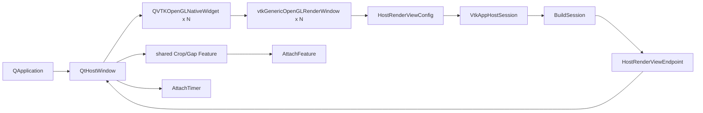

# MVVCVTK Qt5 接入指南

## 1. 范围与事实基线

本文说明如何把当前 MVVCVTK 接入 Qt Widgets 宿主。

| 项目 | 当前事实 |
| --- | --- |
| Host 门面 | `VtkAppHostSession` |
| 一次性配置 | `HostSessionConfig{renderViews}` |
| 主体命令 | `SendData/SendView/SendTool` |
| 可选业务 | Qt 持有 `CropHostFeature` / `GapHostFeature` 并调用各自 `SendRequest/GetState` |
| Timer | `AttachTimer(HostTimerConfig)` |
| QVTK widget | `QVTKOpenGLNativeWidget` |
| render window | `vtkGenericOpenGLRenderWindow` |
| Qt production target | 尚不存在；本文 adapter 代码均为 `[PROPOSAL]` |
| 接纳协议 | Feature 捕获不可变 snapshot，以 version/CAS 接纳或退休结果 |
| 本地实现快照 | 2026-07-27；HEAD `c0b657909bbe150b5b7d39443a0c37b417a27df7` |

代码事实基线：

- `MVVCVTK/include/Host/VtkAppHostSession.h`
- `MVVCVTK/include/Host/Types/HostValueTypes.h`
- `MVVCVTK/include/Host/Types/HostSessionTypes.h`
- `MVVCVTK/include/Host/Types/HostRequestTypes.h`
- `MVVCVTK/include/Host/Types/HostCommandTypes.h`
- `MVVCVTK/include/Host/Types/HostAdapterTypes.h`
- `MVVCVTK/include/Host/HostFeature.h`
- `MVVCVTK/src/Host/VtkAppHostSession.cpp`
- `MVVCVTK/src/Host/HostCommandRouter.cpp`
- `MVVCVTK/features/OrthogonalCrop/include/Host/CropHostFeature.h`
- `MVVCVTK/features/GapAnalysis/include/Host/GapHostFeature.h`
- `test/QtHost/QtHostSmoke.cpp`
- `test/QtHost/QtHostSessionSmoke.cpp`

## 2. 当前完成度

### 2.1 已具备

| 能力 | Qt 接入结论 |
| --- | --- |
| 可变视图拓扑 | `renderViews` 数量就是实际窗口数量 |
| 外部 window 注入 | 每个 view 可注入 QVTK 使用的 GenericOpenGL window |
| interactor 接管 | Host 采用外部 window 已有的 QVTK interactor |
| endpoint | 可按稳定 id 校验 renderer/window/interactor |
| 显式命令 | Qt action 构造主体 DTO 或 Feature 自有 DTO，不碰内部 service |
| Timer | 一个 QVTK TimerEvent 来源驱动所有已注册 Feature |
| 原子 View | Router 全量预校验后统一提交，不产生部分写入 |
| 并发 Feature | Crop 用 expected-snapshot CAS；Gap 用结果 version gate |
| 生命周期 | Qt 强持有 Session/Feature，Session 只弱引用 Feature，endpoint 非拥有 |

### 2.2 未完成

1. 主工程仍是包含 standalone `main.cpp` 的 Application，没有独立 Core library 或 production Qt executable。
2. Qt adapter、五视图 production UI 与部署机验收尚未落地。
3. Timer 创建结果没有从 `StdRenderContext` 回传到 Host；需保留 VTK `ErrorEvent` 与日志门禁。

## 3. 依赖与 ABI

| 项目 | 当前验证值 |
| --- | --- |
| 平台 | Windows x64 |
| 工具集 | MSVC `v145` |
| C++ | C++17 |
| VTK | 9.4.2 |
| VTK Qt ABI | Qt5 |
| Qt 基线 | Qt 5.14.2 `msvc2017_64` |
| Qt 组件 | Widgets、OpenGL |

规则：

1. Qt、VTK、MVVCVTK 架构统一为 x64；禁止混用 MinGW/Qt6。
2. Debug/Release 必须匹配 CRT、Qt 库和 `vtkGUISupportQt-9.4[d].lib`。
3. Qt target 使用 C++17、`/utf-8`。当前 Qt 5.14.2 头与 v145 `/permissive-` 不兼容，包含 Qt 头的 target 使用 `<ConformanceMode>false</ConformanceMode>`。
4. 运行目录同时提供 Qt5 Core/Gui/Widgets/OpenGL、`platforms/qwindows.dll`、VTK、OpenCV 与项目依赖 DLL。
5. `QSurfaceFormat::setDefaultFormat(QVTKOpenGLNativeWidget::defaultFormat())` 必须早于 `QApplication`。

路径契约：Qt 边界用 `QString::toUtf8()` 产生 owning `std::string`；core 在 `PlatformPath` 转 native/UTF-8，VTK 9.4.2 KWSys 窄路径按 UTF-8 解码。`SystemTools::Stat` 的 Windows 超长路径限制不在本轮承诺范围内。

## 4. 工程现状与测试

主 `MVVCVTK/MVVCVTK.vcxproj` 是 Application，包含 `src/App/main.cpp`，链接 VTK/OpenCV，但没有 Qt/GUISupportQt。QtHost 四个工程位于 `test/QtHost`，未加入 `MVVCVTK.sln` 或 `test/MVVCVTK.Tests.sln`。

| 工程 | 覆盖 |
| --- | --- |
| `QtHostSmoke.vcxproj` | Qt/VTK ABI、QVTK + GenericOpenGL、一次 Render |
| `QtHostSessionSmoke.vcxproj` | 单视图 QVTK endpoint、BuildSession 不主动渲染、Timer attach |
| `QtHostMethodTests.vcxproj` | 六类 load/view/crop/gap/export/lifecycle case；质量与跨域断言分别并入 view/crop/gap |
| `QtHostTestCore.vcxproj` | test-only production 源码闭包 |

facade case 覆盖拒绝、UTF-8 路径输入以及 Crop 双视图 pipeline 失败补偿；真实 Unicode RAW/TIFF/PNG I/O 由非 Qt DataManager 集成测试覆盖。完整 Qt 异步成功链仍需 production adapter 验收。

QtHost 工程的编译中间目录按项目名隔离，但共享输出目录且依赖 `QtHostTestCore.lib`。为避免并行重建同一依赖产物，以下验收命令串行执行：

下列命令显式构建三个可执行入口；`QtHostTestCore.vcxproj` 由其中的 ProjectReference 间接串行构建，不单独运行 exe。

```powershell
$env:QT_ROOT = 'D:\qt\5.14.2\msvc2017_64'
$env:Path = "$env:QT_ROOT\bin;F:\lib_cv\VTK\lib\vtk_install\bin;F:\lib_cv\cv\opencv\build\x64\vc16\bin;$env:Path"
$env:QT_PLUGIN_PATH = "$env:QT_ROOT\plugins"

& D:\vs2026\program\MSBuild\Current\Bin\amd64\MSBuild.exe `
  test\QtHost\QtHostSmoke.vcxproj /t:Rebuild /m:1 `
  /p:Configuration=Debug /p:Platform=x64
& test\QtHost\x64\Debug\QtHostSmoke.exe

& D:\vs2026\program\MSBuild\Current\Bin\amd64\MSBuild.exe `
  test\QtHost\QtHostMethodTests.vcxproj /t:Rebuild /m:1 `
  /p:Configuration=Debug /p:Platform=x64
& test\QtHost\x64\Debug\QtHostMethodTests.exe

& D:\vs2026\program\MSBuild\Current\Bin\amd64\MSBuild.exe `
  test\QtHost\QtHostSessionSmoke.vcxproj /t:Rebuild /m:1 `
  /p:Configuration=Debug /p:Platform=x64
& test\QtHost\x64\Debug\QtHostSessionSmoke.exe
```

测试工程不会运行 `windeployqt`；CLI 必须显式设置 PATH 和 `QT_PLUGIN_PATH`。

## 5. Qt 构建链



顺序：

1. QApplication 前设置 QVTK default format；
2. 创建 widget 与 GenericOpenGL window，并先完成 `widget->setRenderWindow()`；
3. 同一个 VTK smart pointer 写入 `HostRenderViewConfig::renderWindow`；
4. show 后等待 QVTK surface/frame ready；
5. 构造 `HostSessionConfig` 与 session；
6. `BuildSession()` 必须返回 `true`；
7. 按 id 校验 endpoint 与 widget window 是同一实例；
8. 构造需要的 Feature，Qt 保留 `shared_ptr`，并调用 `AttachFeature()`；
9. 需要周期驱动时调用 `AttachTimer()`；
10. 只进入 `QApplication::exec()`。

`BuildSession()` 不调用 `SendRenderAll()`，也不存在初始渲染开关。`Start()` 会主动渲染全部 view 并进入阻塞 VTK loop，所以 Qt 绝不能调用 `Start()` 或 `interactor->Start()`。

`AttachTimer()` 会先尝试懒构建 Session，但 Qt 接入仍应保持上面的显式 `BuildSession -> AttachFeature -> AttachTimer` 顺序，便于定位窗口、Feature 与 Timer 各自的失败。其 `true` 只表示 Host hook 已绑定到目标 context，不证明底层 VTK repeating timer 已成功创建。

## 6. 最小 current API 示例

### 6.1 Session 与 Timer

```cpp
HostRenderViewConfig view;
view.id = "primary-3d";
view.role = HostRenderViewRole::Primary3D;
view.window.title = "Primary 3D";
view.window.isAxesVisible = true; // 仅建窗时启用左下角世界方向轴 marker
view.window.viewInit.viewMode = HostRenderMode::CompositeIsoSurface;
view.window.viewInit.background = { 0.08, 0.12, 0.16 };
view.window.viewInit.hasBackground = true;
view.renderWindow = genericOpenGlWindow;

HostSessionConfig config;
config.renderViews.push_back(std::move(view));

auto session = std::make_unique<VtkAppHostSession>(std::move(config));
if (!session->BuildSession()) {
    return false;
}

auto crop = std::make_shared<CropHostFeature>(cropConfig);
auto gap = std::make_shared<GapHostFeature>(gapConfig);
if (!session->AttachFeature(crop)
    || !session->AttachFeature(gap)) {
    return false;
}

HostTimerConfig timer;
timer.isTimerEnabled = true;
timer.targetView = {
    "primary-3d", false, HostRenderViewRole::Primary3D
};
if (!session->AttachTimer(timer)) {
    return false;
}
```

`session` 不拥有 Feature 强引用；`crop`、`gap` 必须由 Qt adapter 保存到关闭阶段。`BuildSession()`、Feature attach/detach 与 Feature 的 `SendRequest()/GetState()` 有明确 owner-thread 约束。Session 的 `Send*` 当前没有逐入口 owner-thread 断言，但 Qt adapter 仍必须把所有 Host/Feature 调用串行放在 GUI/VTK 线程，不能把“未检查”理解为线程安全。

### 6.2 Load

```cpp
HostLoadRequest load;
load.filePath = sourcePath.toUtf8().toStdString(); // public std::string 路径固定为 UTF-8
load.geometry.dimensions = { sizeX, sizeY, sizeZ };
load.geometry.spacing = { spacingX, spacingY, spacingZ };
load.geometry.origin = { originX, originY, originZ };

HostDataRequest request;
request.action = HostDataAction::LoadFile;
request.payload = std::move(load);

const QPointer<QtHostWindow> owner(this);
const bool isAccepted = session->SendData(
    std::move(request),
    [owner](bool isSuccess) {
        if (!owner) return;
        QMetaObject::invokeMethod(owner, [owner, isSuccess] {
            if (owner) {
                owner->statusBar()->showMessage(
                    isSuccess ? "Load complete" : "Load failed");
            }
        }, Qt::QueuedConnection);
    });
```

同步 `true` 是接纳，不是完成。若 dimensions 全为零，只有 `.raw` 文件才尝试从文件名末尾 `NxMxK` 推断；部分零或负数拒绝。文件长度必须精确匹配 float32 layout。

### 6.3 Reload

```cpp
HostReloadRequest reload;
reload.voxels = std::move(voxels);
reload.geometry.dimensions = { sizeX, sizeY, sizeZ };
reload.geometry.spacing = { spacingX, spacingY, spacingZ };
reload.geometry.origin = { originX, originY, originZ };

HostDataRequest request;
request.action = HostDataAction::ReloadBuffer;
request.payload = std::move(reload);
session->SendData(std::move(request), onReloadComplete);
```

DTO 自有 voxels；Host 移入 `VolumeBuffer`，worker 不借用 Qt 内存。service 后置拒绝可能同步返回 `false` 后仍排队 completion(false)，callback 必须有关闭门禁。

### 6.4 View 与 Tool

以下 View/Crop 片段假定 topology 还配置了 `slice-top-down` 与 `composite-volume`；若只复制 6.1 的单窗口最小配置，应把 target 改为已存在的 `primary-3d`。

```cpp
HostViewSetRequest viewSet;
viewSet.targetView = {
    "composite-volume", false, HostRenderViewRole::Composite3D
};
viewSet.materialPreset = HostMaterialPreset::Glossy;
viewSet.volumeQuality = HostVolumeQualityParams{
    HostVolumeQuality::Quality, 766, 1.0, true
};
viewSet.gradientOpacity = std::vector<HostGradientOpacityNode>{
    { 0.0, 0.0 }, { 120.0, 1.0 }
};
viewSet.transferPreset = HostTransferPreset::Percentile;
viewSet.isDenoiseOn = true;
viewSet.iso = 420.0;
viewSet.background = HostBackgroundColor{ 0.08, 0.08, 0.12 };
viewSet.cursor = HostCursorParams{ { 12.0, 24.0, 36.0 }, -1 };
viewSet.visibility = HostVisibilityParams{
    false, true, false
};
viewSet.isAxesVisible = true;
session->SendView({ HostViewAction::Set, std::move(viewSet) });

HostViewResetRequest cameraReset;
cameraReset.targetView = {
    "primary-3d", false, HostRenderViewRole::Primary3D
};
session->SendView({
    HostViewAction::ResetCamera, std::move(cameraReset)
});

HostToolSetRequest toolSet;
toolSet.targetView = {
    "primary-3d", false, HostRenderViewRole::Primary3D
};
toolSet.toolMode = HostToolMode::Navigation;
session->SendTool({ HostToolAction::Set, std::move(toolSet) });
```

View request 的 optional 全缺省时仍可成功 no-op。Router 会先解析 target/context，把 mode、
material/preset、opacity、TF/preset、iso、background、spacing、window-level、volume
quality、gradient opacity、denoise、cursor、元素显隐与方向轴显隐全部转换并校验为候选；任一字段非法时零 setter
调用，合法请求先提交 spacing 事务，再写入其余已验证状态。volume quality、gradient
opacity 与 denoise 只允许有效 mode 为 Volume/CompositeVolume；同一请求修改 mode 时按候选
mode 判断，不能先改 mode 再因后续字段失败留下部分状态。

Volume 画质只保留 `Quality` 与 `Custom`。`Quality` 固定最大轴 766 并启用 jitter；
`Custom` 使用请求的 maxDimension/sampleDistance/jitter。两档都关闭 VTK 自动采样调整，
并固定 ImageSampleDistance 为 1。Crop 或 Gap 成功进入后，其参与 view 在静止、拖拽、
排队和 commit 期间都固定连接 `Quality(766)` producer/mask，并保持固定采样距离与 jitter；
interaction 只提高刷新频率，不切换 producer，也不修改 mapper 参数。
Crop 的参与 view 是 reference 与 effect targets 的精确服务并集，但裁切效果仍只作用于
effect targets。退出、输入失效或 Detach 后恢复进入前配置。例如 `Custom(1000)` 期间进入
Feature 使用 766，退出后仍恢复 1000 及原 sampleDistance/jitter。此过程不会改写 View
getter 返回的配置，多个 Feature 重叠时由最后一个退出者触发恢复。
显式空 `gradientOpacity` 清除自定义函数并恢复 VTK 默认梯度不透明度。Percentile preset
固定使用 2%/98% histogram 分位点并写入 session-wide scalar TF；后续成功 Reload 会按新
DataVersion 重算，手动 `transferNodes` 会把 intent 切回 Manual。denoise 只改变显示 producer，
不修改 DataManager current、validity mask、Crop history 或 Gap snapshot。

窗宽窗位不是 target-local：target 只选择发起写入的 service，WW/WC 实际进入 session 唯一 `SharedInteractionState`，三张 slice 同步更新。当前 3D strategy 不消费 WindowLevel，因此给 3D target 发送也会改共享值，但 3D 画面不变。File/Reload 成功会把 WW/WC 重置为新数据范围默认值；失败和纯 mode rebuild 保留旧值。

运行期范围：material 的 ambient/diffuse/specular/opacity 和 background RGB 位于 `[0,1]`；
specular power 非负；TF 显式数组非空、五个分量都位于 `[0,1]` 且 position 非降序；
gradient 必须 finite、非负且非降序，gradient opacity 位于 `[0,1]`；Custom
`maxDimension` 位于 `[1,16384]` 且 sample distance 为正 finite；spacing 三轴正；WW 正；
iso/WC 及所有浮点都必须 finite。构建期 `HostViewInitConfig` 使用相同 WW/WC 与 TF
校验，不再接受显式空、越界或降序 TF。

### 6.5 Crop

```cpp
CropHostTarget target;
target.referenceView = {
    "primary-3d", false, HostRenderViewRole::Primary3D
};
target.targetViews.viewIds = {
    "primary-3d", "composite-volume", "slice-top-down"
};
target.isTargetViewsUsed = true;

crop->SendRequest({ CropHostAction::Start, target });
crop->SendRequest({ CropHostAction::Box, target });

CropHostModeRequest mode;
mode.target = target;
mode.removalMode = CropRemovalMode::KeepInside;
crop->SendRequest({ CropHostAction::Mode, std::move(mode) });

crop->SendRequest(
    { CropHostAction::Export, target },
    onCropComplete);
```

目标与状态规则：

- `isTargetViewsUsed=true` 只使用显式 `targetViews`，空集合或未知 id/role 整体拒绝；`false` 只使用 `CropHostConfig::defaultTarget`。
- reference、所有 target、input view 与输入 snapshot 在任何 widget/shader 变更前全部解析，失败不留下部分 binding。
- Start 建立 binding；Box/Plane 切换 widget；Mode 设置 KeepInside/RemoveInside；Previous/Next/Node 修改有效 history 前缀。
- `GetState()` 返回 history、`isActive` 和 `isPublishing`，UI 不读取 Session 内部状态。
- Export worker 从 root image/root mask 对 `allHistory` 的绝对前缀做一次融合计算，只生成最终 UCHAR mask；开始时的 current snapshot 仅作为 owner thread 的 CAS expected 令牌。Reload 先提交则 Crop 返回 VersionMismatch；Crop 先提交则后续 Reload 可合法覆盖。
- 物化绝对节点 N 后，N 成为新基线，UI 的相对 history 节点回到 0。Previous 不越过该基线；若仍有 redo 尾部，Next 从 0 继续。RestoreOriginal 才会恢复 root 节点并重新开放完整 redo。

退出：

```cpp
crop->SendRequest({ CropHostAction::Exit, std::monostate{} });
```

Box 的 Inside 是 canonical `[-1,1]^3` 内部；Plane 的 Inside 是法线严格正半空间。KeepInside 保留 Inside，RemoveInside 移除 Inside。Qt 可以在 `isPublishing` 期间禁用冲突按钮以改善交互，但数据正确性只依赖 CAS，不依赖 UI 时序。

图像物化使用 VTK SMP backend。Standalone `main` 在任何 Feature worker 启动前选择 `STDThread`，不可用时回退 `Sequential`；Qt composition root 若不复用该入口，也必须在创建或启动 Feature worker 前完成同样的一次性 backend 选择与 `vtkSMPTools::Initialize()`，不得在运行期切换。

### 6.6 Gap

```cpp
GapHostStartRequest start;
start.targetViews.viewIds = {
    "primary-3d", "slice-top-down"
};
start.surface.isoMode = GapIsoMode::DataRangeRatio;
start.surface.dataRangeRatio = 0.55;
start.voidParams.grayMin = -0.22f;
start.voidParams.grayMax = 0.15f;
start.voidParams.minVolumeMM3 = 0.0001f;
start.voidParams.angleThresholdDeg = 30.0f;
start.voidParams.tensorWindowSize = 1;
start.voidParams.erosionIterations = 2;

gap->SendRequest(
    { GapHostAction::Start, std::move(start) },
    onGapComplete);
```

必须先 `AttachFeature()` 与 `AttachTimer()`。Start 在接纳事务中冻结 image+mask、立即启动 worker，并在成功后保存当前 `activeVersion`；后续 TimerEvent 只轮询/消费终态并交付 completion。旧 `AwaitingInput` phase 已不存在，内部 `AwaitingResult` 也不是公开 `GapHostState`，Qt 不应依赖内部 phase 名称。

```cpp
gap->SendRequest({ GapHostAction::Overlay, std::monostate{} });
gap->SendRequest({ GapHostAction::Exit, std::monostate{} });

const GapHostState state = gap->GetState();
const GapStatistics stats = state.statistics;
```

`GapStatistics` 同批返回 `objectVoxelCount`、`voidVoxelCount`、两者的 mm³ 体积和
`porosityRatio`。`GetState()` 只能在 attached 的 owner thread 读取；其它线程、Detach 后、
退出完成或版本失配时返回 Idle/零统计。

Gap 捕获同一个 snapshot 的 image 与有效域 mask。worker 只对 mask 内体素统计；返回 owner thread 时若 current version 已变化，旧 callback、overlay 和 statistics 全部退休。`GetState()` 在 exit-pending 暴露 `isExitPending=true`，Qt 继续 pump timer，直到 `analysisState==Idle` 且统计归零。Crop 与 Gap 不互查状态、不互斥；composition root 可以为 UI 体验限制按钮，但不能把该策略当作正确性协议。

### 6.7 Export

```cpp
HostVolumeExportRequest output;
output.outputPath = outputPath.toUtf8().toStdString();
session->SendData(
    { HostDataAction::ExportVolume, std::move(output) },
    onExportComplete);

HostSliceExportRequest slices;
slices.outputDir = outputDir.toUtf8().toStdString();
slices.sourceView = {
    "slice-top-down", false, HostRenderViewRole::TopDownSlice
};
session->SendData(
    { HostDataAction::ExportSlices, std::move(slices) },
    onSlicesComplete);
```

## 7. DTO 语义

### 7.1 View target

- 单目标：非空 id 绝对优先，id miss 不回退 role；
- 多目标：ids/roles 按 topology 顺序取去重并集；
- 空多目标不表示全选。

### 7.2 View config

`HostViewInitConfig::viewMode` 是 per-view。运行期 mode、volume quality、gradient opacity
与 denoise 是 target-local；material、scalar TF、percentile preset intent、WW/WC 等进入
session shared state。material preset 在 Router 边界立即解析为共享
`HostMaterialParams`，不形成第二状态 owner。公共 DTO 不保存独立 camera 状态；
一次性复位通过 `HostViewAction::ResetCamera + HostViewResetRequest` 发给目标 context。

Router 校验：

- material 所有浮点 finite，specularPower 非负，opacity `[0,1]`；
- opacity `[0,1]`；
- transfer nodes 的五个分量均 finite 且在 `[0,1]`，position 非降序且显式数组非空；position 是 scalar range 内的归一化坐标；
- material preset 与 numeric material/opacity 互斥，transfer preset 与显式 transfer nodes 互斥；
- volume quality、gradient opacity、denoise 只接受 Volume/CompositeVolume；Custom 参数和 gradient 节点使用上述数值域；
- iso finite；background 三通道 finite 且在 `[0,1]`；
- spacing finite 且三轴正；
- window width 正且 finite，center finite；
- cursor 三个 world 分量 finite，axis 只允许 `-1/0/1/2`。

WW/WC、cursor 与 visibility mask 均属于 session shared state，不是每个 slice 的独立值。三张 slice 共用 world cursor；滚轮推进当前轴，Shift+左键拖动十字线，普通左键拖动 WW/WC。3D 没有 crosshair actor，但 3D 参考平面交互可改变共享 cursor 并联动 slice。

### 7.3 Cursor、可见性与相机命令

| 对象 | Qt/Host 当前控制方式 | 是否可用 `SendView` 运行时切换 |
| --- | --- | --- |
| world cursor | `HostViewSetRequest::cursor` | 是；数据未就绪时保持现状 |
| 世界方向轴 marker | 建窗初值或 `isAxesVisible` | 是；目标 context |
| 2D 十字线 | `visibility.isCrosshairVisible` | 是；会话共享 bit |
| 3D 彩色参考切平面 | `visibility.isPlanes3DVisible` | 是；会话共享 bit |
| 3D cube axes 标尺 | `visibility.isRulerVisible` | 是；会话共享 bit |
| 目标相机复位 | `ResetCamera + HostViewResetRequest` | 是；一次性命令 |
| Crop Box/Plane widget | Start/Box/Plane/Exit 生命周期 | 否，不能独立显隐 |
| Crop shader/mask | Mode/history/Export/RestoreOriginal 驱动 | 否 |

前三个业务元素仍共享同一 visibility mask，target 只选择写入入口；方向轴与相机复位
只作用目标 context，并把目标 service 标脏，由既有 Timer 渲染下一帧。production Qt
adapter 不持有内部 service/context，也不直接调用 endpoint 的 renderer 来替代这些
Host 命令。

### 7.4 Gap

Gap Feature 对 ratio/absolute/gray/minVolume/angle 执行 finite 检查；ratio `[0,1]`，absolute ISO 还必须可表示为 float，grayMin <= grayMax，tensorWindowSize > 0，erosionIterations >= 0。输入 scalar 必须 finite，spacing 三轴必须正且 finite。输入 image 与有效域 mask 来自同一 `ImageSnapshot`，不得跨 version 拼接。

## 8. Timer 与线程

`StdRenderContext::SetInteractorReady()` 为每个 view 尝试创建 33 ms repeating timer。Interaction Timer handler 负责 `VizService::SendUpdates()` 与 dirty render；`AttachTimer()` 在选定 context 上增加 Host hook，不创建第二套 timer。当前 composition 的 router 注册顺序使 App 的 `TimeUpdate` 与 Host hook 共享一次 TimerEvent，但这属于 adapter/组装顺序，不是 Host 公共 API 对“先 App、后 Feature”的永久承诺。Feature 正确性必须继续依赖 snapshot version/CAS，而不能依赖同一 tick 的隐式先后。

线程纪律：

1. widget/window/session 构建和所有 `Send*` 在 Qt GUI/VTK 线程执行；
2. 不从 worker 调 Crop、Gap、View 或 render API；
3. Load/Reload/Export 使用现有 task service，不再包 `QtConcurrent`；
4. callback 用 `QPointer` + queued invocation；
5. Close 状态禁止新 request，并丢弃失效 generation 的 completion。

这些 Qt 纪律属于 adapter 责任，不是 core 内部自动提供的线程切换。

## 9. 所有权与关闭

| 对象 | owner |
| --- | --- |
| QVTK widget | Qt parent-child |
| GenericOpenGL window | adapter smart pointer + QVTK/Host VTK refs |
| session/core/views | adapter 的 `unique_ptr<VtkAppHostSession>` |
| Crop/Gap Feature | adapter 的 `shared_ptr`；Session 只保存 `weak_ptr` |
| endpoint 指针 | 非拥有，只在 session 内有效 |

关闭顺序：

1. UI 进入 Closing，禁用 action/callback 更新；
2. 尽力对 Crop/Gap Feature 发送 Exit，并继续 pump 必要 tick；
3. 对每个 Feature 调用 `DetachFeature()`，再清 adapter 的 Feature 强引用；
4. `session.reset()`；
5. 每个 widget `setRenderWindow(nullptr)`；
6. 清 adapter 持有的 VTK smart pointer；
7. Qt 销毁 widgets/window。

Gap `Exit` 发布 pending；后续 feature tick 会 Stop/join、清 overlay/result 并到 Idle。Feature 析构仍会对未收口 worker 执行最终 Stop + join。Data Export 登记在 `VizService` 的 active task 列表中，`VizService` 析构会等待结果并 join worker；已经进入完成队列或 Qt event queue 的回调仍须通过生命周期门禁失效。

## 10. `[PROPOSAL]` target 拆分

```text
MVVCVTKCore (StaticLibrary，不含 src/App/main.cpp)
  +-- MVVCVTK (现有 standalone Application)
  +-- MVVCVTKQt (新增 Qt Application)
```

Qt target 单独链接 Qt5 Widgets/OpenGL 与 VTK GUISupportQt；Qt 头与 moc/deploy 配置不得进入 Host、Render、feature 或算法模块。

## 11. 常见错误

| 现象 | 原因/处理 |
| --- | --- |
| Qt plugin 错误 | 部署 `platforms/qwindows.dll`，不要误用 offscreen |
| QVTK 空白/OpenGL 错误 | default format 太晚或 window 类型错误 |
| UI 卡死 | 调用了 session/interactor Start |
| endpoint window 不同 | widget 与 Host 注入了不同 window 实例 |
| RAW 失败 | dimensions 非法、文件名哨兵解析失败或字节数不精确 |
| Load true 但未完成 | true 只是接纳；等 completion 并检查 Timer |
| Feature 请求恒 false | 未 `AttachFeature`、非 owner thread，或 Feature 强引用已释放 |
| Gap Start false | 未 AttachTimer、目标/参数/snapshot 不合法 |
| Gap 完成无 overlay | TimerEvent 未持续进入选定 context |
| quality/gradient/denoise 被拒绝 | 目标或同请求候选 mode 不是 Volume/CompositeVolume，或 Custom/节点参数非法 |
| Crop 完成 VersionMismatch | 任务期间 Reload/其他 writer 已发布新 current；旧结果按协议退休 |
| 关闭崩溃 | session 晚于 widget/window 销毁 |
| 中文路径失败 | 确认 Qt 边界使用 `QString::toUtf8()`；core 禁止 ACP/`path::string()` |

## 12. 验收清单

以下 checkbox 是 Qt 生产接入/部署时的需求清单，不是当前 core dirty 实现的完成状态账本；core 功能与测试状态以主计划的实施结果和实际 Debug/Release 记录为准。

### 构建/部署

- [ ] Qt 5.14.2 MSVC x64，未使用 Qt6/MinGW。
- [ ] Debug/Release 与 VTK/CRT 配置一致。
- [ ] Qt target 链接 GUISupportQt。
- [ ] default format 早于 QApplication。
- [ ] 部署 Qt/VTK/OpenCV/外部 DLL 与 qwindows plugin。

### 窗口/生命周期

- [ ] 每个 widget 使用独立 GenericOpenGL window。
- [ ] widget 与 Host config 共享同一 window 实例。
- [ ] BuildSession 返回 true，endpoint 一一匹配。
- [ ] AttachTimer 返回 true，并以实际 TimerEvent/VTK ErrorEvent 验证底层 timer。
- [ ] Qt 生命周期不调用 VTK Start。
- [ ] session 早于 QVTK window/widget 销毁。

### 功能

- [ ] Load/Reload 的 accepted 与 completion 明确区分。
- [ ] View/Tool 按 id/role 工作，非法 DTO 被拒绝。
- [ ] ViewSet 全量事务、material/TF preset 互斥和 volume-only 能力检查符合契约。
- [ ] quality/gradient/denoise 为 per-view，percentile/material 为共享真源，Reload 后 preset 重算正确。
- [ ] WW/WC 三切片共享、3D 不消费、成功 reload 重置与失败保留均符合预期。
- [ ] Crop 显式/默认目标语义、Box/Plane/Mode/history 与 Export CAS 符合状态表。
- [ ] 世界轴、十字线、3D 平面/标尺未被误接成不存在的 Host 运行期 API。
- [ ] Gap Start/Overlay/Exit、同版本 image+mask、旧结果退休与 statistics 正确。
- [ ] Volume/Slice Export completion 正确。
- [ ] 中文、Latin-1 与空格路径经 UTF-8 DTO 完整加载/导出。
- [ ] 关闭期间无悬空 callback、observer 或 render。

### 回归

- [ ] standalone x64 构建通过。
- [ ] 非 Qt 三个测试工程通过。
- [ ] 四个 QtHost 工程串行通过。
- [ ] 五视图、HiDPI、异步成功链与干净部署机单独验收。
