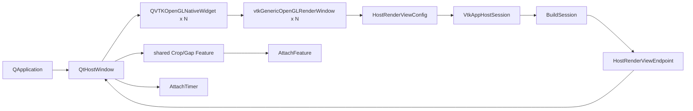

# MVVCVTK Qt5 接入指南

## 1. 范围与事实基线

本文说明如何把当前 MVVCVTK 接入 Qt Widgets 宿主。

| 项目 | 当前事实 |
| --- | --- |
| Host 门面 | `VtkAppHostSession` |
| 一次性配置 | `HostSessionConfig{renderViews}` |
| Qt 主体门面 | `VtkAppHostSession::SendRequest(HostRequest&&, callback)` |
| Host 唯一分发出口 | `HostCommandRouter::Dispatch(HostRequest&&, callback)`；Qt 不直接持有 Router |
| 可选业务 | Qt 持有 `CropHostFeature` / `GapHostFeature` 并调用各自 `SendRequest/GetState` |
| Timer | `AttachTimer(HostTimerConfig)` |
| QVTK widget | `QVTKOpenGLNativeWidget` |
| render window | `vtkGenericOpenGLRenderWindow` |
| Qt production target | 尚不存在；本文 adapter 代码均为 `[PROPOSAL]` |
| 接纳协议 | Feature 捕获不可变 snapshot，以 version/CAS 接纳或退休结果 |
| 本地实现快照 | 2026-07-29；当前工作树 |

代码事实基线：

- `MVVCVTK/include/Host/VtkAppHostSession.h`
- `MVVCVTK/include/Host/Types/HostValueTypes.h`
- `MVVCVTK/include/Host/Types/HostSessionTypes.h`
- `MVVCVTK/include/Host/Types/HostRequest.h`
- `MVVCVTK/include/Host/Types/HostRequestTypes.h`
- `MVVCVTK/include/Host/Types/HostInputTypes.h`
- `MVVCVTK/include/Host/HostFeature.h`
- `MVVCVTK/src/Host/VtkAppHostSession.cpp`
- `MVVCVTK/src/Host/HostCommandRouter.cpp`
- `MVVCVTK/features/OrthogonalCrop/include/Host/CropHostFeature.h`
- `MVVCVTK/features/GapAnalysis/include/Host/GapHostFeature.h`
- `test/QtHost/QtHostSmoke.cpp`
- `test/QtHost/QtHostSessionSmoke.cpp`

## 2. 当前完成度

### 2.1 已具备

| 能力 | Qt 接入结论 |
| --- | --- |
| 可变视图拓扑 | `renderViews` 数量就是实际窗口数量 |
| 外部 window 注入 | 每个 view 可注入 QVTK 使用的 GenericOpenGL window |
| interactor 接管 | Host 采用外部 window 已有的 QVTK interactor |
| endpoint | 可按稳定 id 校验 renderer/window/interactor |
| 显式命令 | Qt action 构造主体 DTO 或 Feature 自有 DTO，不碰内部 service |
| Timer | 一个 QVTK TimerEvent 来源驱动所有已注册 Feature |
| 原子 View | Router 全量预校验后统一提交，不产生部分写入 |
| 并发 Feature | Crop 用 expected-snapshot CAS；Gap 用结果 version gate |
| 生命周期 | Qt 强持有 Session/Feature，Session 只弱引用 Feature，endpoint 非拥有 |

### 2.2 未完成

1. 主工程仍是包含 standalone `main.cpp` 的 Application，没有独立 Core library 或 production Qt executable。
2. Qt adapter、五视图 production UI 与部署机验收尚未落地。
3. Timer 创建结果没有从 `StdRenderContext` 回传到 Host；需保留 VTK `ErrorEvent` 与日志门禁。

## 3. 依赖与 ABI

| 项目 | 当前验证值 |
| --- | --- |
| 平台 | Windows x64 |
| 工具集 | MSVC `v145` |
| C++ | C++17 |
| VTK | 9.4.2 |
| VTK Qt ABI | Qt5 |
| Qt 基线 | Qt 5.14.2 `msvc2017_64` |
| Qt 组件 | Widgets、OpenGL |

规则：

1. Qt、VTK、MVVCVTK 架构统一为 x64；禁止混用 MinGW/Qt6。
2. Debug/Release 必须匹配 CRT、Qt 库和 `vtkGUISupportQt-9.4[d].lib`；数据导出还需要
   `vtkIOCore`、`vtkIOGeometry` 与 `vtkIOPLY`。
3. Qt target 使用 C++17、`/utf-8`。当前 Qt 5.14.2 头与 v145 `/permissive-` 不兼容，包含 Qt 头的 target 使用 `<ConformanceMode>false</ConformanceMode>`。
4. 运行目录同时提供 Qt5 Core/Gui/Widgets/OpenGL、`platforms/qwindows.dll`、VTK、OpenCV 与项目依赖 DLL。
5. `QSurfaceFormat::setDefaultFormat(QVTKOpenGLNativeWidget::defaultFormat())` 必须早于 `QApplication`。

路径契约：Qt 边界用 `QString::toUtf8()` 产生 owning `std::string`；core 在 `PlatformPath` 转 native/UTF-8，VTK 9.4.2 KWSys 窄路径按 UTF-8 解码。`SystemTools::Stat` 的 Windows 超长路径限制不在本轮承诺范围内。

## 4. 工程现状与测试

主 `MVVCVTK/MVVCVTK.vcxproj` 是 Application，包含 `src/App/main.cpp`，链接 VTK/OpenCV，但没有 Qt/GUISupportQt。QtHost 四个工程位于 `test/QtHost`，未加入 `MVVCVTK.sln` 或 `test/MVVCVTK.Tests.sln`。

| 工程 | 覆盖 |
| --- | --- |
| `QtHostSmoke.vcxproj` | Qt/VTK ABI、QVTK + GenericOpenGL、一次 Render |
| `QtHostSessionSmoke.vcxproj` | 单视图 QVTK endpoint、BuildSession 不主动渲染、Timer attach |
| `QtHostMethodTests.vcxproj` | 六类 load/view/crop/gap/export/lifecycle case；质量与跨域断言分别并入 view/crop/gap |
| `QtHostTestCore.vcxproj` | test-only production 源码闭包 |

facade case 覆盖拒绝、UTF-8 路径输入、导出请求接纳以及 Crop 双视图 pipeline 失败补偿；
真实 Unicode RAW/PLY/STL/OBJ I/O 由非 Qt DataManager 集成测试覆盖，Histogram 的
PNG/JPEG 导出属于另一条链。完整 Qt 异步成功链仍需 production adapter 验收。

QtHost 工程的编译中间目录按项目名隔离，但共享输出目录且依赖 `QtHostTestCore.lib`。为避免并行重建同一依赖产物，以下验收命令串行执行：

下列命令显式构建三个可执行入口；`QtHostTestCore.vcxproj` 由其中的 ProjectReference 间接串行构建，不单独运行 exe。

```powershell
$env:QT_ROOT = 'D:\qt\5.14.2\msvc2017_64'
$env:Path = "$env:QT_ROOT\bin;F:\lib_cv\VTK\lib\vtk_install\bin;F:\lib_cv\cv\opencv\build\x64\vc16\bin;$env:Path"
$env:QT_PLUGIN_PATH = "$env:QT_ROOT\plugins"

& D:\vs2026\program\MSBuild\Current\Bin\amd64\MSBuild.exe `
  test\QtHost\QtHostSmoke.vcxproj /t:Rebuild /m:1 `
  /p:Configuration=Debug /p:Platform=x64
& test\QtHost\x64\Debug\QtHostSmoke.exe

& D:\vs2026\program\MSBuild\Current\Bin\amd64\MSBuild.exe `
  test\QtHost\QtHostMethodTests.vcxproj /t:Rebuild /m:1 `
  /p:Configuration=Debug /p:Platform=x64
& test\QtHost\x64\Debug\QtHostMethodTests.exe

& D:\vs2026\program\MSBuild\Current\Bin\amd64\MSBuild.exe `
  test\QtHost\QtHostSessionSmoke.vcxproj /t:Rebuild /m:1 `
  /p:Configuration=Debug /p:Platform=x64
& test\QtHost\x64\Debug\QtHostSessionSmoke.exe
```

测试工程不会运行 `windeployqt`；CLI 必须显式设置 PATH 和 `QT_PLUGIN_PATH`。

## 5. Qt 构建链



顺序：

1. QApplication 前设置 QVTK default format；
2. 创建 widget 与 GenericOpenGL window，并先完成 `widget->setRenderWindow()`；
3. 同一个 VTK smart pointer 写入 `HostRenderViewConfig::renderWindow`；
4. show 后等待 QVTK surface/frame ready；
5. 构造 `HostSessionConfig` 与 session；
6. `BuildSession()` 必须返回 `true`；
7. 按 id 校验 endpoint 与 widget window 是同一实例；
8. 构造需要的 Feature，Qt 保留 `shared_ptr`，并调用 `AttachFeature()`；
9. 需要周期驱动时调用 `AttachTimer()`；
10. 只进入 `QApplication::exec()`。

`BuildSession()` 不调用 `SendRenderAll()`，也不存在初始渲染开关。`Start()` 会主动渲染全部 view 并进入阻塞 VTK loop，所以 Qt 绝不能调用 `Start()` 或 `interactor->Start()`。

`AttachTimer()` 会先尝试懒构建 Session，但 Qt 接入仍应保持上面的显式 `BuildSession -> AttachFeature -> AttachTimer` 顺序，便于定位窗口、Feature 与 Timer 各自的失败。其 `true` 只表示 Host hook 已绑定到目标 context，不证明底层 VTK repeating timer 已成功创建。

仓库自带 `src/App/main.cpp` 是另一个独立客户端：其窗口、热键、Crop/Gap 和启动数据默认值
都属于 standalone 私有装配。Qt adapter 不 include 或调用这些私有 helper，也不等待一个
统一启动配置对象；它在自己的 composition root 中直接构造 `HostSessionConfig`、具体
Feature 配置和具体 Request。

## 6. Current API 逐项示例

Qt 只持有 `VtkAppHostSession` 和显式选择的 Feature，不持有 Router 或内部 service。
主体请求的固定链路是：

```text
Qt action
  -> 具体 Host Request
  -> VtkAppHostSession::SendRequest
  -> HostCommandRouter::Dispatch
```

Crop/Gap 不进入主体 Router；Qt 直接调用各自唯一的 `SendRequest()`。下表是本节的公开
能力覆盖索引：

| 接口或请求 | 示例 |
| --- | --- |
| `BuildSession`、endpoint getters | 6.1 |
| `AttachFeature`、`DetachFeature`、`AttachTimer` | 6.2 |
| `AttachHotkeys`、`Start` | 6.3，说明 Qt 禁用边界 |
| `HostLoadRequest`、`HostReloadRequest` | 6.4 |
| `HostViewSetRequest` 的全部可选字段、`HostViewResetRequest` | 6.5 |
| `HostToolSetRequest`、`HostToolSwitchRequest` | 6.6 |
| `HostDataExportRequest`、`HostSliceExportRequest` | 6.7 |
| `CropHostFeature::SendRequest/GetState` 的全部有效 Action | 6.8 |
| `GapHostFeature::SendRequest/GetState` 的全部有效 Action | 6.9 |

以下片段假定都在 Qt GUI/VTK owner thread 内执行。异步回调统一先检查 `QPointer`，再排队
回到 Qt 对象；同步返回 `true` 只表示请求已接纳。

### 6.1 构建 Session 与查询 endpoint

```cpp
HostRenderViewConfig primaryView;
primaryView.id = "primary-3d";
primaryView.role = HostRenderViewRole::Primary3D;
primaryView.window.title = "Primary 3D";
primaryView.window.isAxesVisible = true;
primaryView.window.viewInit.viewMode =
    HostRenderMode::CompositeIsoSurface;
primaryView.window.viewInit.background = { 0.08, 0.12, 0.16 };
primaryView.window.viewInit.hasBackground = true;
primaryView.renderWindow = genericOpenGlWindow;

HostRenderViewConfig topSlice;
topSlice.id = "slice-top-down";
topSlice.role = HostRenderViewRole::TopDownSlice;
topSlice.window.viewInit.viewMode = HostRenderMode::SliceTopDown;
topSlice.renderWindow = topSliceWindow;

HostSessionConfig config;
config.renderViews.push_back(std::move(primaryView));
config.renderViews.push_back(std::move(topSlice));

auto session =
    std::make_unique<VtkAppHostSession>(std::move(config));
if (!session->BuildSession()) {
    return false;
}
```

`BuildSession()` 幂等；空 topology、重复/非法 view 或任一内部构建失败时返回 `false`。
Qt 注入的 window 必须已经通过 `QVTKOpenGLNativeWidget::setRenderWindow()` 与 widget
绑定。

按 id 查询并核对 Qt 与 Host 使用同一 window：

```cpp
const HostRenderViewEndpoint* endpoint =
    session->GetRenderViewEndpoint("primary-3d");
if (!endpoint
    || endpoint->renderWindow != genericOpenGlWindow.Get()) {
    return false;
}
```

查询 Primary3D 和遍历全部 endpoint：

```cpp
const HostRenderViewEndpoint* primary =
    session->GetPrimaryEndpoint();
if (!primary) {
    return false;
}

for (const HostRenderViewEndpoint& item
    : session->GetRenderViewEndpoints()) {
    qDebug() << QString::fromStdString(item.id);
}
```

endpoint 是非拥有句柄，只能在当前 session topology 存活期间使用。

### 6.2 挂载 Feature、Timer 与关闭解绑

先准备 Qt 自己的 Feature 配置；这些配置不来自 standalone `main.cpp`：

```cpp
const HostViewTarget primary3D{
    "primary-3d", false, HostRenderViewRole::Primary3D
};
const HostViewTarget topDown{
    "slice-top-down", false, HostRenderViewRole::TopDownSlice
};

CropHostTarget cropTarget;
cropTarget.referenceView = primary3D;
cropTarget.targetViews.viewIds = {
    "primary-3d", "slice-top-down"
};
cropTarget.isTargetViewsUsed = true;
cropTarget.source = CropHostSource::CurrentImage;

CropHostConfig cropConfig;
cropConfig.defaultTarget = cropTarget;
cropConfig.inputViews.viewIds = { "primary-3d" };

GapHostStartParams gapStart;
gapStart.targetViews.viewIds = {
    "primary-3d", "slice-top-down"
};
gapStart.surface.isoMode = GapIsoMode::DataRangeRatio;
gapStart.surface.dataRangeRatio = 0.55;
gapStart.voidParams.grayMax = 0.15f;
gapStart.voidParams.minVolumeMM3 = 0.0001;
gapStart.voidParams.erosionIterations = 2;

GapHostConfig gapConfig;
gapConfig.defaultStart = gapStart;
gapConfig.inputViews.viewIds = { "primary-3d" };

auto crop = std::make_shared<CropHostFeature>(
    std::move(cropConfig));
auto gap = std::make_shared<GapHostFeature>(
    std::move(gapConfig));
```

Qt adapter 必须强持有两个 `shared_ptr`。Session 只保存 weak Feature：

```cpp
if (!session->AttachFeature(crop)) {
    return false;
}
if (!session->AttachFeature(gap)) {
    session->DetachFeature(*crop);
    return false;
}
```

绑定唯一 Host timer hook：

```cpp
HostTimerConfig timer;
timer.isTimerEnabled = true;
timer.targetView = primary3D;
if (!session->AttachTimer(timer)) {
    return false;
}
```

`AttachTimer(true)` 只表示 Host hook 绑定成功；Qt 仍需确认 QVTK interactor 的
TimerEvent 持续到达。关闭阶段先停止新请求，再按 Feature 逐个解绑：

```cpp
const bool isGapDetached = session->DetachFeature(*gap);
const bool isCropDetached = session->DetachFeature(*crop);
if (!isGapDetached || !isCropDetached) {
    return false;
}
gap.reset();
crop.reset();
```

需要替换或移除 Host timer hook 时传 `isTimerEnabled=false`：

```cpp
HostTimerConfig stopTimer;
stopTimer.isTimerEnabled = false;
session->AttachTimer(stopTimer);
```

### 6.3 `AttachHotkeys` 与 `Start` 的 Qt 边界

生产 Qt action 直接发送具体 Request，通常不调用 `AttachHotkeys()`。只有宿主明确把
VTK interactor 键盘输入也作为调试入口时才配置它，例如：

```cpp
HostHotkeyConfig debugKeys;
debugKeys.isContextInputEnabled = true;
debugKeys.contextInputViews.viewIds = { "primary-3d" };
debugKeys.modelSwitchKey = 'm';
session->AttachHotkeys(debugKeys);
```

这不会给 Qt action 注入默认路径或请求字段。Qt 不能调用以下接口：

```cpp
// 禁止：Start() 会进入阻塞的 standalone VTK event loop。
// session->Start();
// endpoint->interactor->Start();
```

Qt 的唯一事件循环是 `QApplication::exec()`。

### 6.4 加载与内存重载

定义一个可复用的 Host completion：

```cpp
const QPointer<QtHostWindow> owner(this);
const HostCompleteCallback onHostComplete =
    [owner](bool isSuccess) {
        if (!owner) {
            return;
        }
        QMetaObject::invokeMethod(
            owner,
            [owner, isSuccess] {
                if (owner) {
                    owner->statusBar()->showMessage(
                        isSuccess ? "操作完成" : "操作失败");
                }
            },
            Qt::QueuedConnection);
    };
```

从 UTF-8 路径加载文件：

```cpp
HostLoadRequest load;
load.filePath = sourcePath.toUtf8().toStdString();
load.geometry.dimensions = { sizeX, sizeY, sizeZ };
load.geometry.spacing = { spacingX, spacingY, spacingZ };
load.geometry.origin = { originX, originY, originZ };

const bool isLoadAccepted = session->SendRequest(
    std::move(load), onHostComplete);
```

dimensions 全为零时，只有 `.raw` 文件会尝试从文件名末尾 `NxMxK` 推断；部分零、负数或
文件长度不匹配都会拒绝。

从 Qt 已拥有的数据重载：

```cpp
HostReloadRequest reload;
reload.voxels = std::move(ownedVoxels);
reload.geometry.dimensions = { sizeX, sizeY, sizeZ };
reload.geometry.spacing = { spacingX, spacingY, spacingZ };
reload.geometry.origin = { originX, originY, originZ };

const bool isReloadAccepted = session->SendRequest(
    std::move(reload), onHostComplete);
```

`HostReloadRequest` 自有 `voxels`；布局固定为 X 最快的连续 float32，元素数量必须等于
三维尺寸乘积。Load/Reload 成功会发布新 DataVersion，并按新数据范围重置共享 WW/WC。

### 6.5 View patch：每个字段一个例子

`HostViewSetRequest` 是 patch：只填写本次要修改的字段，未知或不想修改的值不要构造。
所有字段先整体校验，任一字段非法时整笔请求零副作用。View Set/Reset 不允许 callback。

切换渲染模式：

```cpp
HostViewSetRequest request;
request.targetView = primary3D;
request.mode = HostRenderMode::IsoSurface;
session->SendRequest(std::move(request));
```

写入完整数值材质：

```cpp
HostViewSetRequest request;
request.targetView = primary3D;
HostMaterialParams material;
material.ambient = 0.15;
material.diffuse = 0.75;
material.specular = 0.35;
material.specularPower = 24.0;
material.opacity = 0.9;
material.isShadeOn = true;
request.material = material;
session->SendRequest(std::move(request));
```

使用材质预设：

```cpp
HostViewSetRequest request;
request.targetView = primary3D;
request.materialPreset = HostMaterialPreset::Glossy;
session->SendRequest(std::move(request));
```

只修改全局不透明度：

```cpp
HostViewSetRequest request;
request.targetView = primary3D;
request.opacity = 0.4;
session->SendRequest(std::move(request));
```

写入手动标量传递函数：

```cpp
HostViewSetRequest request;
request.targetView = primary3D;
request.transferNodes = std::vector<HostTransferNode>{
    { 0.0, 0.0, 0.0, 0.0, 0.0 },
    { 0.5, 0.25, 0.2, 0.7, 1.0 },
    { 1.0, 1.0, 1.0, 1.0, 1.0 }
};
session->SendRequest(std::move(request));
```

使用 2%/98% Percentile 传递函数预设：

```cpp
HostViewSetRequest request;
request.targetView = primary3D;
request.transferPreset = HostTransferPreset::Percentile;
session->SendRequest(std::move(request));
```

调节等值面 ISO 阈值：

```cpp
HostViewSetRequest request;
request.targetView = primary3D;
request.iso = 420.0;
session->SendRequest(std::move(request));
```

调节目标 renderer 背景：

```cpp
HostViewSetRequest request;
request.targetView = primary3D;
request.background = HostBackgroundColor{ 0.08, 0.08, 0.12 };
session->SendRequest(std::move(request));
```

修改体数据 spacing：

```cpp
HostViewSetRequest request;
request.targetView = primary3D;
request.spacing = std::array<double, 3>{ 0.4, 0.4, 1.0 };
session->SendRequest(std::move(request));
```

调节窗宽窗位：

```cpp
HostViewSetRequest request;
request.targetView = topDown;
request.windowLevel = HostWindowLevelParams{
    600.0, // windowWidth
    120.0  // windowCenter
};
session->SendRequest(std::move(request));
```

WW/WC 属于 session 共享状态，target 只是写入入口；三张 slice 会同步变化。3D strategy
当前不消费 WW/WC，所以给 3D target 发送也会改共享值，但 3D 画面不变。

设置自定义 Volume 画质：

```cpp
HostViewSetRequest request;
request.targetView = primary3D;
request.mode = HostRenderMode::Volume;
request.volumeQuality = HostVolumeQualityParams{
    HostVolumeQuality::Custom, 1000, 0.7, true
};
session->SendRequest(std::move(request));
```

设置梯度不透明度：

```cpp
HostViewSetRequest request;
request.targetView = primary3D;
request.mode = HostRenderMode::Volume;
request.gradientOpacity =
    std::vector<HostGradientOpacityNode>{
        { 0.0, 0.0 }, { 120.0, 1.0 }
    };
session->SendRequest(std::move(request));
```

显式空数组清除自定义梯度不透明度：

```cpp
HostViewSetRequest request;
request.targetView = primary3D;
request.gradientOpacity =
    std::vector<HostGradientOpacityNode>{};
session->SendRequest(std::move(request));
```

启用或关闭显示去噪：

```cpp
HostViewSetRequest request;
request.targetView = primary3D;
request.mode = HostRenderMode::Volume;
request.isDenoiseOn = true;
session->SendRequest(std::move(request));
```

写入共享 world cursor：

```cpp
HostViewSetRequest request;
request.targetView = topDown;
request.cursor = HostCursorParams{
    { 12.0, 24.0, 36.0 }, -1
};
session->SendRequest(std::move(request));
```

逐项修改共享业务元素显隐：

```cpp
HostVisibilityParams visibility;
visibility.isPlanes3DVisible = true;
visibility.isCrosshairVisible = false;
visibility.isRulerVisible = true;

HostViewSetRequest request;
request.targetView = primary3D;
request.visibility = visibility;
session->SendRequest(std::move(request));
```

显示或隐藏目标窗口左下角世界方向轴：

```cpp
HostViewSetRequest request;
request.targetView = primary3D;
request.isAxesVisible = false;
session->SendRequest(std::move(request));
```

复位目标相机：

```cpp
HostViewResetRequest request;
request.targetView = primary3D;
session->SendRequest(std::move(request));
```

材质预设与数值材质/opacity 互斥，TF 预设与手动节点互斥。Volume quality、gradient
opacity、denoise 只允许候选 mode 为 Volume/CompositeVolume；可在同一 patch 中先提供
目标 mode。所有浮点必须 finite；spacing 和 WW 必须为正；颜色、opacity 与 TF
归一化分量位于 `[0,1]`。

### 6.6 Tool 模式

显式写入 Navigation 或 ModelTransform：

```cpp
HostToolSetRequest request;
request.targetView = primary3D;
request.toolMode = HostToolMode::ModelTransform;
session->SendRequest(std::move(request));
```

在两个模式间切换：

```cpp
HostToolSwitchRequest request;
request.targetView = primary3D;
session->SendRequest(std::move(request));
```

Tool Set/Switch 都要求目标 context 存在，也不允许 callback。

### 6.7 数据与切片导出

显式导出 RAW/PLY/STL/OBJ：

```cpp
HostDataExportRequest request;
request.outputPath =
    outputDir.toUtf8().toStdString(); // 目录，不是文件名
request.format = HostDataExportFormat::Ply;
request.sourceView = primary3D;
session->SendRequest(std::move(request), onHostComplete);
```

`format` 缺省时，Volume/CompositeVolume 推断 RAW，IsoSurface/CompositeIsoSurface
推断 PLY，slice 模式拒绝。Data 层生成
`<dimX>x<dimY>x<dimZ>_transform.ext`，Qt 不拼接文件名。

逐层导出切片 PNG，并保持当前切片方向：

```cpp
HostSliceExportRequest request;
request.outputDir = outputDir.toUtf8().toStdString();
request.sourceView = topDown;
session->SendRequest(std::move(request), onHostComplete);
```

指定平面内旋转角：

```cpp
HostSliceExportRequest request;
request.outputDir = outputDir.toUtf8().toStdString();
request.sourceView = topDown;
request.angleDeg = 30.0;
session->SendRequest(std::move(request), onHostComplete);
```

导出在接纳线程冻结 image/mask、iso、model-to-world 和方向；后台不重新读取 current。

### 6.8 Crop 全部 Action

所有例子使用 6.2 的 `crop` 与 `cropTarget`。未 Attach、非 owner thread、正在
`isPublishing`、动作必需字段缺失都会返回 `false`。`None` 是无效哨兵，不发送。

#### 6.8.1 启动新 Box 或 Plane

`Box` 自己会建立/更新 binding 并显示 Box widget，不需要先发送 `Start`：

```cpp
CropHostRequest request;
request.action = CropHostAction::Box;
request.target = cropTarget;
crop->SendRequest(std::move(request));
```

启动 Plane：

```cpp
CropHostRequest request;
request.action = CropHostAction::Plane;
request.target = cropTarget;
crop->SendRequest(std::move(request));
```

只建立 binding、不显示新 widget 时使用 Start：

```cpp
CropHostRequest request;
request.action = CropHostAction::Start;
request.target = cropTarget;
crop->SendRequest(std::move(request));
```

#### 6.8.2 设置保留/移除模式

```cpp
CropHostRequest request;
request.action = CropHostAction::Mode;
request.target = cropTarget;
request.removalMode = CropRemovalMode::KeepInside;
crop->SendRequest(std::move(request));
```

改为 `CropRemovalMode::RemoveInside` 即移除 Box/Plane 的 Inside。

#### 6.8.3 回退、前进与跳转节点

回退到上一个有效节点：

```cpp
CropHostRequest request;
request.action = CropHostAction::Previous;
crop->SendRequest(std::move(request));
```

前进到下一个有效节点：

```cpp
CropHostRequest request;
request.action = CropHostAction::Next;
crop->SendRequest(std::move(request));
```

跳转到相对 history 节点：

```cpp
CropHostRequest request;
request.action = CropHostAction::Node;
request.nodeCount = 2;
crop->SendRequest(std::move(request));
```

Previous/Next/Node 使用当前已绑定 target，不再重复携带 target；没有 active binding 时拒绝。

#### 6.8.4 物化当前 Crop 结果

BuildResult 是唯一允许且要求 callback 的 Crop Action：

```cpp
const QPointer<QtHostWindow> owner(this);
CropHostRequest request;
request.action = CropHostAction::BuildResult;
request.target = cropTarget;

crop->SendRequest(
    std::move(request),
    [owner](CropBuildResult result) {
        if (!owner) {
            return;
        }
        QMetaObject::invokeMethod(
            owner,
            [owner, isSuccess = result.isSucceeded] {
                if (owner) {
                    owner->statusBar()->showMessage(
                        isSuccess ? "裁切物化完成" : "裁切物化失败");
                }
            },
            Qt::QueuedConnection);
    });
```

worker 从 root image/root mask 对绝对历史前缀做一次融合，只生成最终 mask。返回 owner
thread 后用发起时 current snapshot 做 CAS；期间若 Reload 已发布新版本，结果以
`CropFailure::VersionMismatch` 退休，不覆盖新数据。

#### 6.8.5 注册与清除 PolyData 输入

```cpp
CropHostRequest request;
request.action = CropHostAction::SetPolyData;
request.polyData = sourcePolyData;
request.sourceVersion = nextSourceVersion;
crop->SendRequest(std::move(request));
```

`polyData` 必须非空，version 必须非零且严格递增，同一指针不能换版本重复注册。使用它时
令 `cropTarget.source = CropHostSource::RegisteredPolyData`。

```cpp
CropHostRequest request;
request.action = CropHostAction::ClearPolyData;
crop->SendRequest(std::move(request));
```

#### 6.8.6 恢复 root、退出与读取状态

恢复首次成功物化前的 root 数据，并重新开放完整 redo：

```cpp
CropHostRequest request;
request.action = CropHostAction::RestoreOriginal;
crop->SendRequest(std::move(request));
```

退出编辑：

```cpp
CropHostRequest request;
request.action = CropHostAction::Exit;
crop->SendRequest(std::move(request));
```

读取 UI 状态：

```cpp
const CropHostState state = crop->GetState();
ui->previousButton->setEnabled(
    state.isActive && state.history.nodeCount > 0);
ui->buildButton->setEnabled(
    state.isActive && !state.isPublishing);
```

Qt 可以据 `isPublishing` 禁用冲突按钮，但正确性依赖 version/CAS，不依赖 UI 互斥。
图像物化使用 VTK SMP；Qt composition root 必须在任何 Feature worker 启动前一次性选择
backend 并调用 `vtkSMPTools::Initialize()`，运行期不得切换。

### 6.9 Gap 全部 Action

所有例子使用 6.2 的 `gap`。必须先 Attach Feature 和 Timer；`None` 是无效哨兵。

#### 6.9.1 启动计算并调节 Gap ISO

按当前数据范围比例计算阈值：

```cpp
GapHostStartParams start;
start.targetViews.viewIds = {
    "primary-3d", "slice-top-down"
};
start.surface.isoMode = GapIsoMode::DataRangeRatio;
start.surface.dataRangeRatio = 0.55;
start.voidParams.grayMax = 0.15f;
start.voidParams.minVolumeMM3 = 0.0001;
start.voidParams.erosionIterations = 2;

GapHostRequest request;
request.action = GapHostAction::Start;
request.start = std::move(start);
gap->SendRequest(
    std::move(request),
    [owner = QPointer<QtHostWindow>(this)](bool isSuccess) {
        if (!owner) {
            return;
        }
        QMetaObject::invokeMethod(
            owner,
            [owner, isSuccess] {
                if (owner) {
                    owner->statusBar()->showMessage(
                        isSuccess
                            ? "Gap 计算完成"
                            : "Gap 计算失败");
                }
            },
            Qt::QueuedConnection);
    });
```

直接指定输入标量域的绝对 ISO：

```cpp
GapHostStartParams start = gapStart;
start.surface.isoMode = GapIsoMode::AbsoluteValue;
start.surface.absoluteIsoValue = 420.0;

GapHostRequest request;
request.action = GapHostAction::Start;
request.start = std::move(start);
gap->SendRequest(std::move(request));
```

每次修改 Gap 阈值都要构造新的 Start；请求不做“只改阈值”的 partial patch，因为它启动
一批新的分析事务。`grayMax`、`minVolumeMM3`、`erosionIterations` 当前生效；
`grayMin`、角度、tensor window 和高级法向参数仍是预留字段，不应在 UI 中宣称已生效。

#### 6.9.2 隐藏或重新显示 overlay

Overlay 是切换动作，不是显式 bool Set。第一次发送隐藏，再发送一次重新显示：

```cpp
GapHostRequest request;
request.action = GapHostAction::Overlay;
gap->SendRequest(std::move(request));
```

只有活动 Gap 会话可切换。当前 `GapHostState` 不公开 overlay 可见位；
`isViewActive` 表示会话可接受 Overlay/Exit，不等于“当前 overlay 可见”。Qt 若需要按钮文案，
应在每次 `SendRequest(Overlay)` 返回 `true` 后更新自己的显示意图。

#### 6.9.3 退出与读取状态/统计

```cpp
GapHostRequest request;
request.action = GapHostAction::Exit;
gap->SendRequest(std::move(request));
```

Exit 进入 pending 后继续 pump TimerEvent，直到状态回到 Idle：

```cpp
const GapHostState state = gap->GetState();
const GapStatistics stats = state.statistics;

ui->gapExitButton->setEnabled(state.isViewActive);
ui->porosityLabel->setText(
    QString::number(stats.porosityRatio));
const bool isExitDone =
    state.analysisState == GapAnalysisState::Idle
    && !state.isExitPending;
```

成功批次同批发布 object/void voxel count、mm³ 体积与 porosity。worker 返回时若 current
version 已变化，旧 callback、overlay 和 statistics 全部退休。Overlay/Exit 不允许 callback；
Start callback 可选，但生产 Qt 应使用它报告异步完成。

## 7. DTO 语义

### 7.1 View target

- 单目标：非空 id 绝对优先，id miss 不回退 role；
- 多目标：ids/roles 按 topology 顺序取去重并集；
- 空多目标不表示全选。

### 7.2 View config

`HostViewInitConfig::viewMode` 是 per-view。运行期 mode、volume quality、gradient opacity
与 denoise 是 target-local；material、scalar TF、percentile preset intent、WW/WC 等进入
session shared state。material preset 在 Router 边界立即解析为共享
`HostMaterialParams`，不形成第二状态 owner。公共 DTO 不保存独立 camera 状态；
一次性复位通过具体 `HostViewResetRequest` 发给目标 context。

Router 校验：

- material 所有浮点 finite，specularPower 非负，opacity `[0,1]`；
- opacity `[0,1]`；
- transfer nodes 的五个分量均 finite 且在 `[0,1]`，position 非降序且显式数组非空；position 是 scalar range 内的归一化坐标；
- material preset 与 numeric material/opacity 互斥，transfer preset 与显式 transfer nodes 互斥；
- volume quality、gradient opacity、denoise 只接受 Volume/CompositeVolume；Custom 参数和 gradient 节点使用上述数值域；
- iso finite；background 三通道 finite 且在 `[0,1]`；
- spacing finite 且三轴正；
- window width 正且 finite，center finite；
- cursor 三个 world 分量 finite，axis 只允许 `-1/0/1/2`。

WW/WC、cursor 与 visibility mask 均属于 session shared state，不是每个 slice 的独立值。三张 slice 共用 world cursor；滚轮推进当前轴，Shift+左键拖动十字线，普通左键拖动 WW/WC。3D 没有 crosshair actor，但 3D 参考平面交互可改变共享 cursor 并联动 slice。

### 7.3 Cursor、可见性与相机命令

| 对象 | Qt/Host 当前控制方式 | 是否可用 Session `SendRequest` 运行时切换 |
| --- | --- | --- |
| world cursor | `HostViewSetRequest::cursor` | 是；数据未就绪时保持现状 |
| 世界方向轴 marker | 建窗初值或 `isAxesVisible` | 是；目标 context |
| 2D 十字线 | `visibility.isCrosshairVisible` | 是；会话共享 bit |
| 3D 彩色参考切平面 | `visibility.isPlanes3DVisible` | 是；会话共享 bit |
| 3D cube axes 标尺 | `visibility.isRulerVisible` | 是；会话共享 bit |
| 目标相机复位 | `ResetCamera + HostViewResetRequest` | 是；一次性命令 |
| Crop Box/Plane widget | Start/Box/Plane/Exit 生命周期 | 否，不能独立显隐 |
| Crop shader/mask | Mode/history/BuildResult/RestoreOriginal 驱动 | 否 |

前三个业务元素仍共享同一 visibility mask，target 只选择写入入口；方向轴与相机复位
只作用目标 context，并把目标 service 标脏，由既有 Timer 渲染下一帧。production Qt
adapter 不持有内部 service/context，也不直接调用 endpoint 的 renderer 来替代这些
Host 命令。

### 7.4 Gap

Gap Feature 当前对 ratio/absolute/gray/minVolume/angle 执行 finite 检查；ratio 位于
`[0,1]`，解析后的 absolute ISO 必须可表示为 float，grayMin <= grayMax，
tensorWindowSize > 0，erosionIterations >= 0。输入 image 与有效域 mask 来自同一
`ImageSnapshot`，不得跨 version 拼接。当前 `BuildVolumeBuffer` 尚未完整拒绝非 finite
scalar、spacing/origin 与 double-to-float 越界；生产 Qt 应先在上位机数据入口拒绝这些
输入，核心补强由 Gap 生命周期计划继续跟踪。

## 8. Timer 与线程

`StdRenderContext::SetInteractorReady()` 为每个 view 尝试创建 33 ms repeating timer。Interaction Timer handler 负责 `VizService::SendUpdates()` 与 dirty render；`AttachTimer()` 在选定 context 上增加 Host hook，不创建第二套 timer。当前 composition 的 router 注册顺序使 App 的 `TimeUpdate` 与 Host hook 共享一次 TimerEvent，但这属于 adapter/组装顺序，不是 Host 公共 API 对“先 App、后 Feature”的永久承诺。Feature 正确性必须继续依赖 snapshot version/CAS，而不能依赖同一 tick 的隐式先后。

线程纪律：

1. widget/window/session 构建和所有 `SendRequest` 在 Qt GUI/VTK 线程执行；
2. 不从 worker 调 Crop、Gap、View 或 render API；
3. Load/Reload/Export 使用现有 task service，不再包 `QtConcurrent`；
4. callback 用 `QPointer` + queued invocation；
5. Close 状态禁止新 request，并丢弃失效 generation 的 completion。

这些 Qt 纪律属于 adapter 责任，不是 core 内部自动提供的线程切换。

## 9. 所有权与关闭

| 对象 | owner |
| --- | --- |
| QVTK widget | Qt parent-child |
| GenericOpenGL window | adapter smart pointer + QVTK/Host VTK refs |
| session/core/views | adapter 的 `unique_ptr<VtkAppHostSession>` |
| Crop/Gap Feature | adapter 的 `shared_ptr`；Session 只保存 `weak_ptr` |
| endpoint 指针 | 非拥有，只在 session 内有效 |

关闭顺序：

1. UI 进入 Closing，禁用 action/callback 更新；
2. 尽力对 Crop/Gap Feature 发送 Exit，并继续 pump 必要 tick；
3. 对每个 Feature 调用 `DetachFeature()`，再清 adapter 的 Feature 强引用；
4. `session.reset()`；
5. 每个 widget `setRenderWindow(nullptr)`；
6. 清 adapter 持有的 VTK smart pointer；
7. Qt 销毁 widgets/window。

Gap `Exit` 发布 pending；后续 feature tick 会 Stop/join、清 overlay/result 并到 Idle。Feature 析构仍会对未收口 worker 执行最终 Stop + join。Data Export 登记在 `VizService` 的 active task 列表中，`VizService` 析构会等待结果并 join worker；已经进入完成队列或 Qt event queue 的回调仍须通过生命周期门禁失效。

## 10. `[PROPOSAL]` target 拆分

```text
MVVCVTKCore (StaticLibrary，不含 src/App/main.cpp)
  +-- MVVCVTK (现有 standalone Application)
  +-- MVVCVTKQt (新增 Qt Application)
```

Qt target 单独链接 Qt5 Widgets/OpenGL 与 VTK GUISupportQt；Qt 头与 moc/deploy 配置不得进入 Host、Render、feature 或算法模块。

## 11. 常见错误

| 现象 | 原因/处理 |
| --- | --- |
| Qt plugin 错误 | 部署 `platforms/qwindows.dll`，不要误用 offscreen |
| QVTK 空白/OpenGL 错误 | default format 太晚或 window 类型错误 |
| UI 卡死 | 调用了 session/interactor Start |
| endpoint window 不同 | widget 与 Host 注入了不同 window 实例 |
| RAW 失败 | dimensions 非法、文件名哨兵解析失败或字节数不精确 |
| 导出路径生成错误 | `HostDataExportRequest::outputPath` 必须是目录；文件名由 Data 层生成 |
| 网格导出失败 | iso 非 finite、model-to-world 非法、mask 全空或等值面结果为空 |
| Load true 但未完成 | true 只是接纳；等 completion 并检查 Timer |
| Feature 请求恒 false | 未 `AttachFeature`、非 owner thread，或 Feature 强引用已释放 |
| Gap Start false | 目标/参数/snapshot 不合法，或已有活动/待退出会话 |
| Gap 接纳后不完成/无 overlay | 未 AttachTimer，或 TimerEvent 未持续进入选定 context |
| quality/gradient/denoise 被拒绝 | 目标或同请求候选 mode 不是 Volume/CompositeVolume，或 Custom/节点参数非法 |
| Crop 完成 VersionMismatch | 任务期间 Reload/其他 writer 已发布新 current；旧结果按协议退休 |
| 关闭崩溃 | session 晚于 widget/window 销毁 |
| 中文路径失败 | 确认 Qt 边界使用 `QString::toUtf8()`；core 禁止 ACP/`path::string()` |

## 12. 验收清单

以下 checkbox 是 Qt 生产接入/部署时的需求清单，不是当前 core dirty 实现的完成状态账本；core 功能与测试状态以主计划的实施结果和实际 Debug/Release 记录为准。

### 构建/部署

- [ ] Qt 5.14.2 MSVC x64，未使用 Qt6/MinGW。
- [ ] Debug/Release 与 VTK/CRT 配置一致。
- [ ] Qt target 链接 GUISupportQt。
- [ ] default format 早于 QApplication。
- [ ] 部署 Qt/VTK/OpenCV/外部 DLL 与 qwindows plugin。

### 窗口/生命周期

- [ ] 每个 widget 使用独立 GenericOpenGL window。
- [ ] widget 与 Host config 共享同一 window 实例。
- [ ] BuildSession 返回 true，endpoint 一一匹配。
- [ ] AttachTimer 返回 true，并以实际 TimerEvent/VTK ErrorEvent 验证底层 timer。
- [ ] Qt 生命周期不调用 VTK Start。
- [ ] session 早于 QVTK window/widget 销毁。

### 功能

- [ ] Load/Reload 的 accepted 与 completion 明确区分。
- [ ] View/Tool 按 id/role 工作，非法 DTO 被拒绝。
- [ ] ViewSet 全量事务、material/TF preset 互斥和 volume-only 能力检查符合契约。
- [ ] quality/gradient/denoise 为 per-view，percentile/material 为共享真源，Reload 后 preset 重算正确。
- [ ] WW/WC 三切片共享、3D 不消费、成功 reload 重置与失败保留均符合预期。
- [ ] Crop 显式/默认目标语义、Box/Plane/Mode/history 与 BuildResult CAS 符合状态表。
- [ ] 世界轴、十字线、3D 平面/标尺分别通过当前 View Request 字段控制，没有绕过 Host。
- [ ] Gap Start/Overlay/Exit、同版本 image+mask、旧结果退休与 statistics 正确。
- [ ] RAW/PLY/STL/OBJ Data Export 与逐层 PNG Slice Export completion 正确。
- [ ] Data Export 只传目录，落盘文件名符合 `NxMxK_transform.ext`。
- [ ] 中文、Latin-1 与空格路径经 UTF-8 DTO 完整加载/导出。
- [ ] 关闭期间无悬空 callback、observer 或 render。

### 回归

- [ ] standalone x64 构建通过。
- [ ] 非 Qt 三个测试工程通过。
- [ ] 四个 QtHost 工程串行通过。
- [ ] 五视图、HiDPI、异步成功链与干净部署机单独验收。
