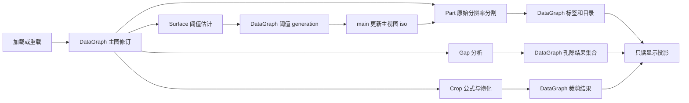

# MVVCVTK 实验分支完整功能说明书与局限

更新日期：2026-09-05。本文面向运行 standalone 的使用者、上位机集成开发者和实验分支审查者。

## 1. 版本、范围与阅读约定

### 1.1 对应的代码状态

| 项目 | 本文对应状态 |
| --- | --- |
| 分支 | `experiment/feature-integration-20260905-01` |
| 工作树 | `F:/code/vs/MVVCVTK-worktrees/experiment-feature-integration-20260905-01` |
| 主分支基线 | `master@013e9730e4fd9a6136e312a3a317c18c9708e0d0` |
| 编写核验时的实验分支 HEAD | `503f56979d4037568fa56af546d2ab3e4bc10fd8` |
| 文档的实际实现基准 | 上述 HEAD **加提交前已暂存的 16 个文件修改**，包含真实数据修复、演示入口和 `SetPreviousPart`；最终阅读版本以承载本文的本地提交为准 |
| 集成状态 | 已合入实验分支，尚未整体合入主干；功能分支、实验分支及其工作树均保留 |
| 文档属性 | 用户明确要求写入并本地提交本文；虽然 `/md/` 默认被 Git 忽略，本次只将本文精确加入提交，不改变忽略规则或 SDK 内容 |

不能只检出上述旧 HEAD 就认为得到了本文全部功能；本次一起提交的实现修改也是本文描述的输入。验证时的内容身份见 [真实数据验证记录](../out/build/real-validation.json) 和 [上一部件接口验证记录](../out/build/previous-part-validation.json)。这些日志在本工作树存在，重新克隆仓库不会自动带上被忽略的 `out/` 内容。

### 1.2 功能范围

本文覆盖本轮七条集成线及 standalone 已组合的基础功能：

| 能力 | 对应集成线或模块 | 使用入口 |
| --- | --- | --- |
| 表面确定、自动阈值、亚体素测量网格 | SurfaceDetermination | `U`；仓内 Feature API |
| 部件分割、稳定身份、目录状态、上一部件 | PartSegmentation | `B`、`N`、`Shift+N`；仓内 Feature API |
| 会话帧协调 | Session frame coordinator | 自动运行；`F4`、Scene API |
| 交互运行时策略 | Interaction runtime policy | 鼠标、快捷键、Host 输入 endpoint |
| 渲染产物管线 | Render product pipeline | 体渲染、等值面、质量切换 |
| 统一数据图 | DataGraph | 所有数据发布；`F2`、可信 Feature 端口 |
| 图像描述与标签读取 | ImageDescriptor / LabelMap | `F2`、`F3`、Host 值读取 API |
| 方框/平面裁剪、历史与主源切换 | OrthogonalCrop | `O/P`、裁剪按键、Crop API |
| 孔隙分析与结果叠加 | GapAnalysis | `G/J`、Gap API |
| 加载、导出、五视图、停止 | Host / standalone | `main`、Host 请求与状态 API |

下文区分三种事实：**源码能力**是模块已实现的能力；**main 入口**是本示例实际组合并绑定的操作；**验证证据**是确实执行过的测试或运行。没有快捷键的 API 不等于未实现；某个小样本测试通过也不等于已验证任意真实数据。

### 1.3 产品和信任边界

- `VtkAppHostSession` 是 Host 组合根；应用通过请求、状态快照、endpoint 和 Feature 句柄交互。
- SDK 产品仍为 `MVVCVTK::Host`、`MVVCVTK::OrthogonalCrop`、`MVVCVTK::GapAnalysis`。PartSegmentation、SurfaceDetermination 是仓内 Feature，不能因在此示例可用就认为已被安装或打包进 SDK。
- `MVVCVTK::HostAPI`、`MVVCVTK::FeatureSPI` 是接口目标，不是额外业务产品。Host 不依赖具体 Feature，Feature 之间不互相依赖。
- `examples/standalone` 负责显式组合。将自动阈值传给视图、让部件分割读取视图阈值，都是应用层组合行为。
- 正式数据以 **DataGraph 为唯一真源**。相机、质量、选中高亮等各有明确的展示或目录状态范围，不能把渲染缓存当作原始数据。
- 可信 Feature 是 `trusted-in-process` 扩展，能够持有受约束的 VTK 快照；它不是插件安全沙箱。
- Qt 本体和上位机 UI 由宿主提供。SDK 固定工具链，不承诺跨编译器、运行库或配置的稳定 ABI。

## 2. 构建、启动与运行模式

### 2.1 环境

当前工程支持 Windows x64、C++17、CMake 4.2+、Visual Studio 18 2026、MSVC v145。Debug 使用 `/MDd`，Release 使用 `/MD`；Release 默认启用 AVX2。依赖锁定版本包括 VTK 9.4.2、OpenCV 4.12.0；仓内 Qt 测试使用配置好的 Qt 环境。

本工作树使用自己的 `out/build/vs2026-x64`。官方依赖根为 `deps/official`，DefX 根配置为 `F:/code/vs/MVVCVTK/deps/third_party/defx`。其它机器需替换为已准备好的实际目录。

### 2.2 构建开关

| CMake 变量 | 项目默认值 | 本实验配置及影响 |
| --- | --- | --- |
| `MVVCVTK_BUILD_ORTHOGONAL_CROP` | ON | ON；关闭后 standalone 不构建 |
| `MVVCVTK_BUILD_GAP_ANALYSIS` | ON | ON；关闭后 standalone 不构建 |
| `MVVCVTK_BUILD_PART_SEGMENTATION` | OFF | ON；控制部件库、相关测试和 main 中部件入口 |
| `MVVCVTK_BUILD_SURFACE_DETERMINATION` | OFF | ON；控制表面库、相关测试和 main 中 `U` 入口 |
| `MVVCVTK_BUILD_STANDALONE` | ON | ON；输出 `MVVCVTK.exe` |
| `MVVCVTK_BUILD_TESTING` | ON | ON |
| `MVVCVTK_BUILD_QT_TESTING` | option 默认 OFF | `vs2026-x64` preset 设为 ON；依赖 TESTING=ON |
| `MVVCVTK_ENABLE_AVX2` | ON | Release 构建使用 |

关闭 Part/Surface 后，main 的相应功能和自动演示步骤会被条件编译移除。Host 可以在 Feature 关闭时独立构建。

### 2.3 本机启动命令

以下命令在本实验工作树执行；真实数据优先使用 Release。配置命令会更新该 `binaryDir` 的构建开关。

```powershell
Set-Location 'F:/code/vs/MVVCVTK-worktrees/experiment-feature-integration-20260905-01'
cmake --preset vs2026-x64 `
  -DMVVCVTK_BUILD_PART_SEGMENTATION=ON `
  -DMVVCVTK_BUILD_SURFACE_DETERMINATION=ON `
  -DMVVCVTK_DEFX_ROOT=F:/code/vs/MVVCVTK/deps/third_party/defx
cmake --build --preset vs2026-release --target MVVCVTKStandalone --parallel 6

$demoDeps = Join-Path (Get-Location).Path 'deps/official'
$env:PATH = "$demoDeps/vtk/bin;$demoDeps/opencv/x64/vc16/bin;$demoDeps/qt/bin;$env:PATH"
$env:QT_PLUGIN_PATH = "$demoDeps/qt/plugins"
.\out\build\vs2026-x64\bin\Release\MVVCVTK.exe
```

Visual Studio 工程是 `out/build/vs2026-x64/MVVCVTK.slnx`，启动项目为 `MVVCVTKStandalone`，生成程序名为 `MVVCVTK.exe`。Debug 程序位于对应的 `bin/Debug`。Debug 的大体积计算耗时不能用本文 Release 数据替代。

### 2.4 命令行模式

各模式互斥。main 目前没有 `--input`、维度、阈值或预算的通用命令行解析器。

| 参数 | 数据 | 行为及退出 |
| --- | --- | --- |
| 无参数 | 硬编码真实 RAW | 打开交互式五窗口，等待操作 |
| `--demo` | 内置 32³ 双部件、含内孔样本 | 交互演示 |
| `--demo-audit` | 同一小样本 | 通过 Host 输入路径执行自动流程；当前全功能配置为 22 步，结束退出 |
| `--real-audit` | 硬编码真实 RAW | `U` 求阈值、`B` 分割、选择/标签/帧读取、重启并取消；当前为 8 步 |
| `--part-auto` | 原 32³ 双部件样本 | API 自动分割，检查两个部件后退出 |
| `--part-manual` | 原 32³ 双部件样本 | 手动按 `B`；不是实际 RAW 测试 |
| `--part-profile` | 硬编码真实 RAW | 直接用 Feature 的 main 默认参数分割并计时；初始阈值 0.5，不先调用 `U` |
| `--quality-audit` | 硬编码真实 RAW | 检查质量档准入和 Render 后退出；可能非常耗时、耗内存 |
| `--drag-audit` | 硬编码真实 RAW | 执行已有渲染/交互审计后退出 |
| `--gap-auto` | 硬编码真实 RAW | 数据就绪后自动启动 Gap；不应当作具有总 deadline 的批处理接口 |

`--demo-audit` 和 `--real-audit` 将视图设为 `HostInjected`；其它交互模式默认使用 `NativeInteractor`。两种自动审计是输入与结果校验工具，不是外部测量认证。

### 2.5 本例真实输入

| 参数 | 当前值 |
| --- | --- |
| 文件 | `F:/data/ct/1536x1536x1536_1440.raw` |
| 类型与布局 | float32、单分量、X 最快 |
| 尺寸 | 1536 × 1536 × 1536 |
| 体素数量 | 3,623,878,656 |
| 文件字节数 | 14,495,514,624，即 13.5 GiB |
| 输入 spacing | 三轴均 0.1537 mm |
| 输入 origin | 0、0、0 |
| datasetId | `standalone-ct-1536x1536x1536` |
| 本次读取的标量范围 | 约 -1.61715 至 2.12749 |
| main 初始主视图 iso | 0.5，之后可由 `U` 更新 |

这些是样例参数，不是加载器对任意 RAW 自动识别出的格式。更换文件必须同时核对几何、标量类型、字节数和元数据；仅修改路径可能得到错误体积或加载失败。

## 3. 窗口、鼠标与完整快捷键

### 3.1 五窗口

| 标识 | 窗口 | 初始模式 | 用途 |
| --- | --- | --- | --- |
| `primary-3d` | A，600×600 | `CompositeIsoSurface` | 主体等值面、部件/Gap 叠加、iso 接收目标 |
| `composite-volume` | E，600×600 | `CompositeVolume` | 体渲染、传输函数；main 多数状态信息写到此窗口标题 |
| `slice-top-down` | B，400×400 | `SliceTopDown` | 俯视切片；standalone 唯一事件循环启动窗口及 timer 目标 |
| `slice-front-back` | C，400×400 | `SliceFrontBack` | 前后切片 |
| `slice-left-right` | D，400×400 | `SliceLeftRight` | 左右切片 |

窗口初始位置是固定桌面坐标，不会自动适配任意屏幕布局。main 初始隐藏 3D 参考平面和切片十字线，A 显示方向轴。数据就绪后，待有效几何出现再适配视角；`F5` 可再次适配。

### 3.2 鼠标行为

| 视图/工具 | 操作 | 当前行为 |
| --- | --- | --- |
| 2D 切片 | 滚轮 | 前后移动切片，普通步长 5，Ctrl 步长 10 |
| 2D 切片 | 左键拖动 | 调整窗宽、窗位 |
| 2D 切片 | Shift+左键拖动 | 移动联动游标/十字线；是否显示十字线由可见性控制 |
| 2D 切片 | Ctrl+左键拖动 | 定轴旋转 |
| 2D 切片 | 右键拖动 | 缩放 |
| 3D 导航 | 点中可交互参考平面后拖动 | 调整对应切片平面 |
| 3D 导航 | 未被 Feature/平面处理的操作 | 交给当前 VTK 相机交互样式 |
| Crop 激活 | 拖动方框或平面 widget | 改变裁剪几何；完成拖动后才提交相应历史/预览 |

Feature 会优先处理属于自己的输入。工具状态、目标视图和修饰键会影响同一鼠标动作的实际处理者。本文没有将原生鼠标拖动延迟认定为已完成验证。

### 3.3 快捷键表

焦点应位于本程序目标视图。字母键以下按无修饰键列出；Shift、Ctrl、Alt 按表组合。

| 键 | 功能 | 说明 |
| --- | --- | --- |
| `F1` | 输出完整帮助 | 控制台输出，并更新状态标题 |
| `F2` | 图像描述与 DataGraph | 显示数据集、尺寸、范围、来源、revision、bindings 和输入关系 |
| `F3` | LabelMap 目录与样本 | 列出当前可读标签及前几个精确整数值 |
| `F4` | Scene/Frame 状态 | 输出各窗口 epoch、Feature、质量、交互和输入修订 |
| `F5` | 适配所有视图 | 发送 `HostViewResetRequest`，也会恢复自动窗宽窗位 |
| `U` | 自动 ISO50 | 发布阈值估计并应用到 A 的 `isovalue` |
| `Ctrl+U` | 清除表面确定结果 | 清除当前估计/结果绑定；不将 A 的 iso 自动还原为 0.5 |
| `Alt+U` | 请求取消表面确定 | 没有正在执行的对应请求时可能被拒绝 |
| `B` | 部件分割 | 读取 A 当前 iso；进行 RAM 准入检查 |
| `Shift+B` | 全部部件叠加显示/隐藏 | 不重新计算标签 |
| `Ctrl+B` | 清除当前部件结果 | 清除活动结果与显示，不承诺清空全部图历史内存 |
| `Alt+B` | 请求取消部件计算 | 旧结果存在时，取消成功保留它 |
| `N` | 选择下一部件 | main 按目录顺序循环选择 |
| `Shift+N` | 选择上一部件 | 调用 `SetPreviousPart`；首项回绕末项 |
| `Ctrl+H` | 隐藏/显示选中部件 | 无选择时 main 使用第一个部件 |
| `Ctrl+R` | 切换复核标记 | 修改 `isReviewed`，不是重新执行算法 |
| `G` | 启动孔隙分析 | 使用 main 的 Gap 参数，与 `U` 的阈值不是自动联动关系 |
| `J` | Gap 启动或叠加切换 | 未启动视图时发 Start；已经活动时切换叠加 |
| `O` | 方框裁剪 | 激活 Box widget |
| `P` | 平面裁剪 | 激活 Plane widget |
| `0` | 裁剪定位模式 | `CropRemovalMode::None` |
| `1` | 保留 Inside | Box 内部或平面法线正半空间 |
| `2` | 移除 Inside | 保留其余区域 |
| `Ctrl+3` | 构建裁剪结果 | Crop 自身入口，会附带默认 target 和完成回调 |
| `4` / `5` | 裁剪历史上一/下一节点 | 裁剪历史，不是部件选择 |
| `Alt+0` … `Alt+9` | 指定裁剪历史节点 | 节点必须存在且当前历史可用 |
| `6` | 恢复裁剪原始来源 | Crop 自身入口 |
| `Ctrl+7` | main 的裁剪构建入口 | **当前有接线缺陷：缺少 target，会被拒绝；使用 Ctrl+3 或第 9 节 API** |
| `Ctrl+8` | 将裁剪结果设为主源 | 需先成功构建结果 |
| `Ctrl+9` | 恢复裁剪原始来源 | main 转发 `RestoreOriginal` |
| `L` / `Shift+L` | 体渲染质量下一/上一档 | 目标为 E |
| `I` / `Shift+I` | 主体等值面质量下一/上一档 | 目标为 A |
| `C` / `Shift+C` | 调整 TF 颜色 | main 修改一个颜色节点的红色通道，每次 ±0.05 |
| `V` / `Shift+V` | 调整 TF 透明度 | main 修改一个透明度节点，每次 ±0.05 |
| `M` | 切换导航/模型变换工具 | 发送 `HostToolSwitchRequest`；**不是切换 Volume/IsoSurface 模式** |
| `S` | 导出主体数据 | main 显式配置 PLY，默认主 3D 来源，目录 `F:/data` |
| `T` | 导出切片序列 | 目录 `F:/data`；在目标切片窗口触发，3D 目标会被拒绝 |
| `Escape` | 退出活动 Feature 或恢复导航工具 | 由输入优先级决定；Host 路由本身不是 Session Stop 命令 |

main 中 `C/V` 的编辑节点规则是：节点数量大于 2 时取倒数第二个，否则取最后一个；数值钳制在 `[0,1]`。它不是完整传输函数编辑器。`Y`、`Shift+U` 已不属于当前 main 的表面确定快捷键。

## 4. Host API 与会话生命周期

源码入口：[VtkAppHostSession.h](../MVVCVTK/include/Host/VtkAppHostSession.h)、[HostRequestTypes.h](../MVVCVTK/include/Host/Types/HostRequestTypes.h)。

### 4.1 生命周期与查询接口

| 接口 | 用途/约束 |
| --- | --- |
| 构造 `VtkAppHostSession(HostSessionConfig)` | 保存视图拓扑及 owner dispatcher 配置 |
| `BuildSession()` | 幂等构建；空拓扑、重复/无效视图或任一构建失败返回 false |
| `AttachFeature` / `DetachFeature` | 在 owner thread 挂载或解绑 Feature |
| `AttachTimer` | 绑定 owner timer pump，重复调用替换旧 handler |
| `AttachHotkeys` | 绑定/替换主体命令输入 |
| `Start()` | standalone VTK 事件循环；Qt 使用已有事件循环时不调用 |
| `Stop()` | owner thread 显式停止，幂等；失败保留可重试状态 |
| `GetIsStopped()` / `GetStopState()` | 读取停止状态 |
| `SendPendingStops()` / `GetPendingStopCount()` | 处理错误线程析构等情况下滞留的停止任务 |
| `GetRenderViewState(s)` | 读取 View 展示状态值快照 |
| `GetSceneViewState(s)` | 读取包含相机、Feature 和帧提交信息的只读投影 |
| `GetRenderViewEndpoint(s)` / `GetPrimaryEndpoint()` | 获取会话拥有的 renderer/window/interactor 非拥有观察指针 |
| `GetInputEndpoint()` | 获取值语义输入端点 |

`HostStopState` 包含 `Stopped`、`Building`、`Running`、`StopRequested`、`Stopping`、`StopPending`。停止请求已经发出，不等于停止已经完成。

### 4.2 主体请求目录

| 请求类型 | 主要字段 | 效果 |
| --- | --- | --- |
| `HostLoadRequest` | `filePath`、`geometry`、`metadata` | 加载 RAW 或 TIFF 来源 |
| `HostReloadRequest` | `voxels`、`geometry`、`metadata` | 从拥有型 float 数组重载 |
| `HostViewSetRequest` | `targetView` 和可选 mode/material/TF/iso 等 | 只更新指定 View 的展示字段 |
| `HostSessionSetRequest` | 可选 spacing、cursor | 修改会话级几何/游标状态，不接收 targetView |
| `HostViewResetRequest` | `targetView` | 恢复自动窗宽窗位并适配相机 |
| `HostToolSetRequest` | target、`Navigation/ModelTransform` | 指定交互工具 |
| `HostToolSwitchRequest` | target | 在上述两种工具间切换 |
| `HostDataExportRequest` | outputPath、可选 format、sourceView | 导出主体 RAW 或网格 |
| `HostSliceExportRequest` | outputDir、sourceView、可选 angleDeg | 导出 PNG 切片序列 |

`HostViewSetRequest` 可写字段为 `mode`、`material`、`materialPreset`、`opacity`、`volumeTransferFunction`、`iso`、`background`、`windowLevel`、`volumeQuality`、`visibility`、`isAxesVisible`。未提供的字段保留原值。

`HostViewTarget` 精确 ID 优先，ID 无效时不会回退到 role。`HostViewTargets` 的空集合不表示全部窗口。

### 4.3 请求与回调

优先使用：

```cpp
bool SendRequestResult(HostRequest&& request, HostResultCallback onComplete);
```

返回值表达接纳情况，`HostResult` 表达结果。callback 必须非空；拒绝或同步请求的结果可能在发送函数返回前回调。Load/Reload/Export 等后台操作的完成依赖 owner pump。`HostErrorCode` 包含 `None`、`SessionNotReady`、`WrongThread`、`RequestRejected`、`OperationFailed`。

```cpp
// 已构建的 Session，当前在 owner thread。
HostViewSetRequest request;
request.targetView.viewId = "primary-3d";
request.iso = 0.446685; // 这里只演示赋值，业务值应来自当前数据的估计或用户设置。
session.SendRequestResult(std::move(request), [](HostResult result) {
    if (!result.isSucceeded) {
        std::cerr << result.message << '\n';
    }
});
```

兼容接口 `SendRequest(HostRequest&&, HostCompleteCallback)` 仍存在；不能把它的一个 bool 混同于所有异步算法的最终结果。

### 4.4 Qt 集成与关闭

Qt 上位机通过 `HostRenderViewConfig::renderWindow` 提供匹配配置的 QVTK/VTK 窗口，使用 Qt 事件循环，保持 owner timer pump，并通过 `HostSessionConfig::sendOwnerTask` 投递 owner 任务。Feature 句柄和异步回调所依赖的对象应保持有效；Qt 回调可使用 `QPointer` 保护 UI 对象。

正常退出应停止新请求，在 owner thread 调用 `Stop()`。返回 false/`StopPending` 时保留 Session、Feature、窗口和相关对象，并继续在 owner thread 重试；确认 `GetIsStopped()` 后再释放外部对象。不得通过提前销毁窗口或 detached worker 绕过停止流程。

endpoint 不是可长期缓存的所有权句柄。Session 移动、重建、解绑或析构后，应重新获取并校验。

## 5. 加载、元数据与坐标语义

### 5.1 支持的入口

- RAW 加载需要明确的几何和正确的输入格式。本例使用 float32 RAW，不存在任意 RAW 自动格式识别。
- `HostLoadRequest` 的来源类型可为 `RawFile` 或 `TiffSeries`。TIFF 支持文件或目录读取；目录只枚举常规文件，扩展名 `.tif/.tiff` 不区分大小写，按自然排序逐张解码并沿 Z 轴拼接；没有匹配图像的目录会失败。
- `HostReloadRequest` 拥有 `std::vector<float>`；元素数量必须等于三轴尺寸乘积，来源 kind 应为 `Memory`。
- main 没有文件选择对话框或通用文件路径参数。API 支持的来源不等于 main 已为其提供 UI。

RAW 请求仅在 dimensions 为 `{0,0,0}` 时尝试从 `.raw` 文件名主干尾部的 `NxMxK` 推断三个正整数；分隔符支持 `x/X`，尺寸之前可以有文本前缀，最后一段必须完整为数字。它不识别标量类型或 spacing。本例文件名带 `_1440` 后缀，因此 main 显式传入尺寸。TIFF 请求不能使用该 RAW 文件名回退，也需要提供有效 layout。

### 5.2 ImageDescriptor

`GetImageDescriptor()` 是 metadata-only 查询，不复制整卷体素。主要字段：

| 字段组 | 内容 |
| --- | --- |
| `metadata.identity` | datasetId，可选 inspectionId/objectId/batchId |
| `metadata.source` | kind、uri、byteSize、可选 digest |
| scalar 语义 | quantity、unit、slope、intercept、可选 noData |
| attributes | bool、int64、uint64、double、string 类型属性 |
| 几何 | extent、dims、spacing、origin、3×3 行主序 direction |
| 数值布局 | scalarRange、valueType、componentBytes、componentCount、byteOrder、tupleOrder |
| 版本 | dataRevision、bindingRevision |

metadata 的校验约束如下，长度单位都是字节：

- `datasetId` 不超过 256；`inspectionId/objectId/batchId/uri/digest` 不超过 4096。
- `scalar.quantity/unit` 不超过 128；`slope` 必须有限且非零，`intercept` 和存在时的 `noData` 必须有限。
- 最多 64 个 attributes；key 不超过 128 且不得重复，字符串值不超过 4096，double 值必须有限。
- 必填文本 `datasetId/uri/quantity/unit` 和 attribute key 不能为空。

`byteSize=0` 可由加载边界解析实际字节数。`noData` 只解释标量语义，逐体素有效性仍由 validity mask 表达。

### 5.3 坐标、单位和布局

- `dims` 顺序是 X/Y/Z；extent 是包含端点的 `[minX,maxX,minY,maxY,minZ,maxZ]`。
- `HostVolumeGeometry` 输入按 ITK/LPS 约定，加载边界转换为内部规范 RAS；读取 descriptor 时不可再次自行做同一转换。
- `origin + direction × diag(spacing) × index` 决定物理坐标。不要把体素索引、模型坐标和世界展示变换混用。
- 当前公开 byte order 为 `Native`，tuple order 为 `XFastestInterleaved`。不是可任意切换大小端的解析接口。
- spacing 会影响物理体积和距离。没有正确采样间距、单位或校准时，不应将输出宣称为可靠物理计量。
- 图像 scalarRange 不是材料均值、直方图峰值或自动阈值；slope/intercept、unit 也不应被调用方不加核对地重复应用。

## 6. DataGraph 唯一数据真源

### 6.1 数据模型

| 类型 | 含义 |
| --- | --- |
| `DataEntityId` | 数据实体身份 |
| `DataRevisionRef` | entityId + generation，指向具体不可变修订 |
| `DataSnapshot` | `shared_ptr<const DataRevision>`，持有类型、输入关系、payload 和 provenance |
| `DataBinding` | 命名槽位，包含可空 target 及独立 binding revision |
| `DataGraphSnapshot` | commitId 和只读 GraphView |
| `DataTransaction` | 原子发布 outputs 与 bindings，带条件校验和提交策略 |
| `DataChangeSet` | 一次提交发布了哪些修订、哪些 binding 变化 |

data revision 表示具体数据，binding revision 表示某个命名槽位改变了几次。二者不能互相替代；`resultRevision`、`catalogRevision`、`sceneEpoch` 也各自有独立范围。



### 6.2 命名绑定与来源关系

当前使用的关键活动绑定包括：

- `session.primary.volume`：主图像。
- `analysis.parts.active`：部件结果集合。
- `analysis.gaps.active`：孔隙结果集合。
- `analysis.surface-determination.active`：阈值或表面 generation。

Crop 也将 recipe/output 作为正式数据发布，主源提升走独立事务。消费者应通过返回的 ref、binding 和输入关系读取，不通过猜测 generation 数字寻找结果。

`GetDataRelation` 可报告 `ValidForItsInputs` 或 `OutOfDateRelativeToCurrentBinding`。历史数据仍可能自洽，但不再对应当前主图；这与数据丢失不同。

### 6.3 可信端口 API

普通 `VtkAppHostSession` 没有名为 `GetDataGraph()` 的通用公开成员。`F2` 是 main 控制 Feature 利用 `HostFeatureContext::data` 实现的查询。

| 端口 | 接口 |
| --- | --- |
| `TrustedDataReadPort` | `GetDataGraph`、`GetData`、`GetDataQuery`、`GetDataBinding`、`GetProjectData`、`GetDataRelation` |
| 可信 VTK 视图读取 | `GetImageGrid`、`GetPrimaryImage`、`GetLabelMap`、`GetSurfaceMesh` |
| `TrustedDataWritePort` | `CreateDataEntityId`、`SetDataType`、`SetDataCommit`、`AttachDataChange`、`DetachDataChange` |

查询一条业务链时应复用同一个 graph snapshot，再按返回的 ref 取数据。`GetProjectData()` 当前只是 commitId 和 bindings 的值快照，不是项目文件保存接口。

事务支持实体 head、binding revision 和 expected target 校验。只有事务成功，结果才成为正式数据。数据变化在状态锁内排队，解锁后由提交路径消费，callback 在 observer 锁外执行，单个 callback 异常不会回滚已提交数据或阻断其它 observer。该回调不保证 owner/UI 线程，也没有自动 UI dispatcher；不要在其中直接操作要求 owner thread 的 UI 或 VTK 对象。

### 6.4 局限

- 当前没有 DataGraph 项目持久化、会话保存/恢复或完整图导入导出 API。
- 清除活动 binding 不等于立即释放所有历史 payload；持有的快照、历史和其它读者会延长内存生命周期。
- DataGraph 不等同于可编辑场景树、Qt model、跨 Feature 全局管理器或自动业务编排器。
- VTK 可信视图受 owner、租约和不可变读取契约约束；不能通过 const 包装推断所有 VTK 写操作都安全。
- 图中对象存在，不等于普通 Host LabelMap API 一定公开它；还要满足下一节的活动来源条件。

## 7. 图像与 LabelMap 值读取

入口：[ImageReadTypes.h](../MVVCVTK/include/Data/ImageReadTypes.h)、[TrustedDataPort.h](../MVVCVTK/include/Host/TrustedDataPort.h)。

### 7.1 接口目录

| 接口 | 结果 |
| --- | --- |
| `GetImageReadState()` | 普通图像读取值状态；不是 metadata-only 查询 |
| `GetImageReadResult(maxBytes)` | 带预算和错误原因的整卷复制 |
| `GetImageReadResult(ImageReadRequest)` | 整卷或 region 复制 |
| `GetImageReadChunk(request, voxelOffset)` | 按 region 内 offset 分块读取 |
| `StartImageRead(request, callback)` | 后台复制，owner timer 回调 |
| `GetLabelMapDescriptors()` | 当前可见标签目录 |
| `GetLabelMapDescriptor(id)` | 指定标签描述 |
| `GetLabelMapReadResult(request)` | 标签整卷或 region 值复制 |
| `GetLabelMapReadChunk(request, voxelOffset)` | 标签分块复制 |

同步整块默认预算 `imageReadLimit=512 MiB`；chunk 上限 `imageChunkLimit=8 MiB`。13.5 GiB 的本例输入不适合默认同步整卷读取。

### 7.2 region 和 chunk

`ImageReadRegion` 使用相对源图像的半开区间 `[offset, offset+size)`；三轴 size 必须为正。省略 region 表示整卷。

region 返回的局部 extent 从 0 开始，origin 已按 spacing/direction 平移到首体素。`voxelOffset` 是该 region 的 X-fast 线性体素偏移，**不是字节偏移**。`requiredBytes` 表示整个 region 的所需字节数，`nextVoxelOffset` 表示下一块起点。

读取者应检查 `error`、`state`、`isDone` 和版本。建议每次 owner 事件循环只处理一个有限 chunk，再投递后续步骤；不要在 UI 回调里用一个大 while 循环读完数十 GiB。

```cpp
auto descriptor = session.GetLabelMapDescriptor("PartSegmentation.labels");
if (descriptor) {
    LabelMapReadRequest request;
    request.id = descriptor->id;
    request.expectedRevision = descriptor->dataRevision;
    request.maxBytes = imageChunkLimit;
    auto chunk = session.GetLabelMapReadChunk(request, 0);
    if (chunk.error == LabelMapError::None && chunk.state) {
        // 按 descriptor 的整数类型解释 chunk.state->values。
        // 后续事件循环使用 chunk.nextVoxelOffset 续读，直到 chunk.isDone。
    }
}
```

普通 ImageReadRequest 没有 `expectedRevision` 字段，每次 chunk 调用重新取得当前图像状态；跨多次调用时，应用应比对返回的 `dataRevision/bindingRevision`，遇到变化应丢弃混合结果并重新读取。这是调用方防止重载前后数据混拼的责任。

### 7.3 标签目录准入和精确值

标签需要由当前活动 bindings 可达，具有有效 producer provenance，`source-volume` 指向当前主图修订，且几何与主图完全一致。重复 ID 被视为歧义并从普通目录移除。来源已失效的历史标签不能假定仍出现在 `GetLabelMapDescriptors()` 中。

LabelMap 支持有符号/无符号 8/16/32/64 位整数。当前 Part 标签为 uint32，Gap 保留供应商原始整数标签。`scalarRange` 是 double 展示范围，不能用于恢复精确的 64 位整数；精确值应从 bytes 解码，必要时用 `memcpy` 到对应整数类型，避免未对齐访问。

LabelMap 的 ID 最多 128 字节，displayName 最多 256 字节。普通 descriptor 不返回完整 LabelDefinition 表，也没有按标签 ID 一键导出整个结果包的接口。

### 7.4 异步与错误

`StartImageRead` 需要非空 callback；同一 Session 同时只接纳一个尚未回调的读取。admission 可为 `Accepted/InvalidRequest/Busy/QueueFull/Stopping/Unavailable`。worker 读取不可变快照，结果由 owner pump 兑现。没有对外的独立读取取消 token；会话停止会协作取消。

图像常见错误包括 `NoImage`、`InvalidData`、`UnsupportedType`、`InvalidRegion`、`TooLarge`、`CopyFailed`、`Cancelled`。标签还包括 `NotFound`、`VersionMismatch` 等。枚举中存在的错误不一定都由当前 reader 路径触发，应用应处理未知/新增错误并展示原始结果。

LabelMap 普通读取目前是同步接口，没有 `StartLabelMapRead`。不要把 chunk 上限理解为全流程零内存开销；每块仍创建值副本。

## 8. 输入路由、帧协调与渲染

### 8.1 原生与注入输入

`HostRenderViewConfig::inputMode` 在构建时固定为 `NativeInteractor` 或 `HostInjected`。`HostInputEndpoint::SendInput` 只接受后者；原生窗口不能在运行中通过同一 endpoint 临时改成注入模式。

`HostInputEvent` 提供 viewId、事件种类、x/y、修饰键、keyCode 和 keySym。坐标使用 **VTK 左下角原点的 display 像素**；Qt 屏幕坐标不能直接不转换地发送。事件包括滚轮、主/次按钮按下抬起、移动、KeyPress/KeyRelease、TextInput、Cancel。

返回的 `HostInputResult` 区分成功、是否处理、是否抑制默认行为，以及错误码/消息。未知 View、错误线程、Session 未 ready 或 inputMode 不匹配会拒绝输入。

Feature 通过 `HostInputBinding` 注册自己的目标视图和回调，保留 Feature 的输入归属。main 对动作键实现重复按下抑制，并按物理字符键清理 release 状态，因此先松 Shift/Ctrl、后松字符键也能恢复。Host 通用 `M/S/T/Escape` 的匹配规则不等同于每个 Feature 的严格 chord 匹配，不应推断所有按键都可任意组合修饰键。

### 8.2 帧协调行为

Feature 通过 `SendSceneDelta` 提交已经准备好的变化意图。Host 在 owner frame 中收集更新、核验来源与作用域、构建 stage、提交逻辑 epoch，然后渲染和兑现完成通知。

变化优先级包括 `Scene/Overlay/Refinement`，作用域包括 `RequiredAllViews/TargetViewOnly/BestEffort`。优先级决定处理资格，不能改写 Geometry → Camera → Overlay 的依赖顺序。

提交前失败会保留/恢复待处理意图；提交后 Render 失败表现为待渲染重试，不能把已发布的数据或场景提交假装回滚。DataGraph commit、目录 revision 和 frame epoch 不是一个统一的“全局事务号”。

### 8.3 Scene 状态字段

| 字段 | 表示什么 | 不能据此推断什么 |
| --- | --- | --- |
| `isAvailable` | View 当前可用性 | 已知 ID 不一定始终可用 |
| `presentation` | mode、material、TF、iso、质量、游标等值投影 | 不提供内部 service 身份 |
| `camera` | position、focalPoint、viewUp、clippingRange 等只读值 | 不授予相机写权限 |
| `presentationRevision` | App 展示事务版本 | 不覆盖全部 Camera/Feature/Overlay 变化 |
| `activeFeatureIds` | 当前活动 Feature 来源 | 不等于模块已安装或结果已持久化 |
| `sceneEpoch` | Session 逻辑提交 epoch | 不等于 GPU 已完成显示 |
| `renderedEpoch` | 该 View 最近完成 Render 的提交 | 小于 sceneEpoch 时仍有渲染待处理 |

这些快照可供上位机展示状态或诊断，但不是可写 SceneManager、持久化场景树或 Qt model。当前相机通用命令是 `HostViewResetRequest`；更复杂相机控制不能通过修改返回的快照实现。

### 8.4 质量档与产物管线

| 档位 | 目标各轴尺寸相对原始尺寸 | 主要含义 |
| --- | --- | --- |
| `Auto` | 按加载时资源条件解析 | 自动选择一次初始比例，不按每帧耗时反复改变尺寸 |
| `Low` | 25% | 较低显示分辨率 |
| `High` | 50% | 较高显示分辨率 |
| `XHigh` | 75% | 更高显示分辨率 |
| `Ultra` | 100% | 原始尺寸显示输入 |

实际整数尺寸还受取整和最小合法尺寸约束。枚举循环顺序为 `Auto → Low → High → XHigh → Ultra → Auto`。

Volume 与 Iso 使用同一质量枚举，但有独立的 LOD 计划和产物构建。Volume 还涉及射线步长、交互预览、GPU 纹理和 partitions；Iso 涉及重采样、FlyingEdges 与网格。两者不能把一个质量枚举当作相同的耗时或内存保证。

产物键包含输入/掩码修订及 identity/MTime、目标尺寸、iso 或相关处理参数。候选在后台准备，owner 核验后应用；过期或失败候选不能替换有效活动产物。显示 LOD 不改变 DataGraph 原始图像、Part 全分辨率标签或 Surface 测量快照。

Volume GPU 切换会释放旧资源后查询驱动可用显存，必要时使用 partitions 分块上传。驱动扩展不可用时使用配置回退预算。分块改变上传和渲染方式，不应被描述为偷偷降低显式质量档的目标尺寸。准入/上传失败会尝试恢复旧活动资源；恢复失败仍需报告。

### 8.5 渲染局限

- 大体积 LOD、等值面和 GPU 上传仍可能明显耗时；异步准备不表示每一帧都无阻塞。
- 请求被接纳、状态值更新、产物就绪和 GPU 显示完成是不同阶段。
- `Ultra` 不保证在当前 RAM/显存下可接纳；软件不能据显式请求承诺任意尺寸必定显示成功。
- 体渲染质量与材料/透明度、采样距离共同影响观感，不等于算法或测量精度等级。
- main 将 VTK SMP 线程数设置为 `max(1, min(8, 默认线程数/2))`，给交互保留资源；这不约束所有供应商库的内部线程。
- `C/V` 只调整少量 TF 节点。完整 TF、材质、背景、轴线和模式设置应通过 Host API。

## 9. OrthogonalCrop：裁剪、历史、物化与主源切换

入口：[CropHostFeature.h](../MVVCVTK/features/OrthogonalCrop/include/Host/CropHostFeature.h)、[OrthogonalCropTypes.h](../MVVCVTK/features/OrthogonalCrop/include/OrthogonalCropTypes.h)。

### 9.1 功能与数据

当前可用交互几何为 Box 和 Plane。`Inside` 对 Box 表示其有向盒内部，对 Plane 表示法线指向的正半空间。`None` 仅定位，`KeepInside` 保留 Inside，`RemoveInside` 移除 Inside。

裁剪历史保存公式参数；预览、结果物化、将结果设为主图是独立步骤。`CropHistoryState` 包含 nodeCount、operationCount、editMode、hasEditableOp、isEditing、baseNodeCount 和 allOperationCount。`CropHostState` 还返回 source/recipe/output revision、commitId、isActive、isPublishing。

### 9.2 请求目录

```cpp
bool SendRequest(CropHostRequest request, CropBuildCallback onComplete = nullptr);
CropHostState GetState() const;
```

| Action | 参数/前提 | 行为 |
| --- | --- | --- |
| `Start` | target | 建立当前裁剪目标 |
| `Box` / `Plane` | target | 激活对应几何 widget |
| `Mode` | target + removalMode | 设置定位/保留/移除语义 |
| `Previous` / `Next` | 已绑定有效历史 | 移动活动历史前缀 |
| `Node` | nodeCount | 定位历史节点 |
| `BuildResult` | **target + 非空 callback** | 异步构建并发布 recipe/output |
| `SetPrimaryResult` | 已有成功物化结果 | 更新当前主图 binding |
| `RestoreOriginal` | 当前裁剪来源可恢复 | 恢复原始来源 |
| `SetPolyData` | 非空 polyData | 接入可信网格路径 |
| `ClearPolyData` | 对应路径可用 | 清除该网格路径输入 |
| `Exit` | Feature 当前可退出 | 清理活动裁剪显示和相关绑定状态 |

只有 `BuildResult` 接受构建完成 callback；其它 action 携带 callback 会被拒绝。未 attached、非 owner thread、正在 publishing 或必要参数缺失也会拒绝。

接纳构建后，完成 callback 由后续 owner `OnHostTick()` 中的 `SendReadyCompletes()` 消费，不在 `SendRequest()` 返回时表示构建已完成。宿主必须继续推进 owner pump。`SetPrimaryResult` 是另一个同步 owner-thread 请求，构建成功不会自动执行主源切换。

### 9.3 推荐流程

1. 按 `O` 或 `P` 激活几何。
2. 用 `1/2` 选择保留或移除；拖动 widget，结束拖动。
3. 使用 `4/5` 或 `Alt+数字` 检查活动历史。
4. 按 **`Ctrl+3`** 构建，等待 `CropBuildResult::isSucceeded`。
5. 需要后续算法处理裁剪结果时，再按 `Ctrl+8` 提升为主源。
6. 通过 `F2` 确认主图 revision 已变化，再重新执行依赖主图的 Surface/Part/Gap。
7. 使用 `6` 或 `Ctrl+9` 恢复原始来源。

正确的 API 构建片段如下；`crop` 已 attach，widget/历史已准备就绪：

```cpp
CropHostTarget target;
target.referenceView.viewId = "primary-3d";
target.targetViews.viewIds = {
    "primary-3d", "composite-volume", "slice-top-down",
    "slice-front-back", "slice-left-right"
};
target.isTargetViewsUsed = true;

CropHostRequest build;
build.action = CropHostAction::BuildResult;
build.target = target;
const bool accepted = crop.SendRequest(std::move(build), [](CropBuildResult result) {
    if (!result.isSucceeded) std::cerr << result.message << '\n';
});
```

### 9.4 局限和失败

- 当前 `Ctrl+7` 的 main 转发只设置 action，没有传 target，因此会被拒绝；Crop 自身的 `Ctrl+3` 会附带默认 target。本文只记录此接线缺陷，没有修改已暂存代码。
- 仅打开 widget 或改变显示预览，不等于已生成新的主数据。需要明确 BuildResult 和 SetPrimaryResult。
- 拖动中、历史无效、空结果、版本不匹配、内存不足或 worker 失败都可能阻止构建。
- `CropShape::Cylinder` 是预留入口，不能列作已经可用的交互裁剪功能。
- 任意复杂 CAD 布尔运算、自动分割、网格修补不属于当前 Box/Plane 功能。
- `CropFailure` 包含 NoImage/NoPolyData、BadBounds/OutOfBounds、NoBackend、BadBuildMode、LowRam、MaskFailed/ImageFailed/ClipFailed、BadInput、EmptyResult、Busy、VersionMismatch、WorkerStartFailed/WorkerFailed。
- `SetPolyData` 属于已声明的可信 VTK 契约，调用方仍需保证坐标和对象生命周期；不能由此取得 Host 私有实现所有权。
- 当前 22 步小样本快捷键审计覆盖 O/P 激活，没有自动执行原生鼠标拖动后完整裁剪物化流程。

## 10. GapAnalysis：孔隙分析与叠加

入口：[GapHostFeature.h](../MVVCVTK/features/GapAnalysis/include/Host/GapHostFeature.h)、[GapHostTypes.h](../MVVCVTK/features/GapAnalysis/include/Host/GapHostTypes.h)。

### 10.1 输入参数与 main 配置

| 参数 | Feature 类型语义 | 本例真实数据配置 |
| --- | --- | --- |
| `targetViews` | 结果展示目标 | A 主 3D 和 B 俯视切片 |
| `surface.isoMode` | DataRangeRatio 或 AbsoluteValue | AbsoluteValue |
| `surface.dataRangeRatio` | `min+(max-min)*ratio`，请求需在 `[0,1]` | 非本例使用模式 |
| `surface.absoluteIsoValue` | 原始标量域阈值 | 0.172 |
| `surface.backgroundMean` | 传给 DefX 的背景定义 | -1.617 |
| `surface.materialMean` | 传给 DefX 的材料定义 | 0.453 |
| `voidParams.isFilterEnabled` | 是否启用供应商体积过滤 | false |
| `voidParams.minVolumeMM3` | 最小缺陷体积 | 0.0；关闭过滤时不参与筛选 |

`--demo/--demo-audit` 将 iso/background/material 改为 `0.5/0/1`。这些是 main 配置；API 结构的默认数字不能当作适合真实 CT 的参数。

### 10.2 请求和结果

```cpp
bool SendRequest(GapHostRequest request, GapHostCallback onComplete = nullptr);
GapHostState GetState() const;
```

- `Start`：必须提供 start 参数；返回 bool 表达接纳，完成 callback 返回 `GapHostResult`。
- `Overlay`：切换已有叠加显示，不能带 callback。
- `Exit`：退出当前显示/活动路径，不能带 callback。

worker 完成后，由 owner tick 消费结果并发布；正常完成通知通过 `SendOwnerComplete` 排入 owner 任务，callback 在内部锁外执行。宿主必须继续推进 owner pump，不能在 owner thread 阻塞等待 callback。停止阶段若完成任务无法排队，当前 owner 路径会直接兑现失败通知。

`GapAnalysisState` 为 Idle/Running/Succeeded/Failed/Stale。结果状态为 `Succeeded`、`SucceededWithDisplayFailure`、`Failed`、`SourceChanged`。

成功发布的结果包含 labelMap、voidTable、voidMesh、statisticsData 和 resultSet 的 DataGraph ref，以及 sourceRevision/commitId。统计字段为 objectVoxelCount、voidVoxelCount、objectVolumeMM3、voidVolumeMM3、porosityRatio。

发布顺序是先完成 DataGraph transaction，再从已提交 revision 取得可信视图，调用 `SetCommittedView` 和 `SendSceneDelta` 接入显示。数据提交与显示接入因此存在可区分的成功状态。

`SucceededWithDisplayFailure` 表示正式数据可能已经进入图，但显示没有完成；不能重报为“计算没有产生结果”。main 标题可能仍显示 succeeded，判断时应读取结构化 status 和 message。

### 10.3 运行时与局限

- Gap 使用私有 `MVVCVTKGapKernel.dll` + `DefXAnalysis.dll`。Debug/Release、x64、MSVC 运行库和 VTK 配置必须匹配。
- 外部运行可设置 `MVVCVTK_GAP_RUNTIME_DIR` 为包含当前配置两 DLL 的绝对目录。未配置时只使用应用同目录的运行时对；显式目录错误不会从 PATH 或当前工作目录回退寻找。
- DefX 供应商头、STL/VTK 接口不进入 Gap 主库的公开消费者边界。
- 标签、区域和统计保留供应商结果语义；Feature 不把标签自行二值化、重编号，也不从标签重新臆算供应商统计。
- validity mask 不直接传给 DefX；当前 worker 会在私有 float 输入中以有效域最小值填充无效域。这不等于供应商算法原生理解任意 mask 边界。
- `U` 只更新 A 的 iso；`G` 仍使用保存的 GapStart 参数。要让 Gap 采用同一阈值/均值，应用必须显式构造新的 start 参数。
- 来源或目标视图在计算到显示之间变化，可导致 SourceChanged 或显示失败。
- Gap 大体积执行还受供应商内核、私有输入、标签和网格内存约束；不能套用 Surface 的 64 KiB 估计工作集。
- 本次真实数据性能数字来自 Surface/Part 流程，不代表已测试同一体积的所有 Gap 参数组合。小样本内孔结果也不能替代真实缺陷尺寸校准。
- `porosityRatio` 是算法返回的比值；展示为百分数需明确乘 100，不能把体素计数或材料定义自行替换成另一个分母。

## 11. SurfaceDetermination：自动 iso 与高级测量网格

入口：[SurfaceDeterminationHostFeature.h](../MVVCVTK/features/SurfaceDetermination/include/Host/SurfaceDeterminationHostFeature.h)、[SurfaceDeterminationHostTypes.h](../MVVCVTK/features/SurfaceDetermination/include/Host/SurfaceDeterminationHostTypes.h)。此模块当前只在仓内使用。

### 11.1 当前 main 的用途

`U` 固定发送 `SurfaceDeterminationMethod::AutomaticIso50`，先得到适合当前输入的全局阈值，再将它提供给 A 的 `HostViewSetRequest::iso`。

该流程读取同一个不可变原始数据快照，发布包含来源 revision 的阈值 generation。main 在 callback 中再次核对当前图像 source revision，成功后才写视图 iso。模块本身不依赖 Part 或 Host 私有实现。

成功的 AutomaticIso50 没有测量 mesh；points/objectCount 为 0 可以是正常结果。应检查 `isoEstimate`，不能用“点数必须大于 0”判断自动阈值是否成功。

### 11.2 自动阈值算法与输出

1. 按各轴 `ceil(dimension/128)` 的间隔，从原始标量场规则采样；最多 128³，即 2,097,152 个样本。
2. 两遍复用同一采样格，跳过无效或非有限样本；构建 512-bin 直方图并平滑。
3. AutomaticIso50 将最高的平滑峰视作占主导的背景峰，在其右侧寻找分离材料峰，避免两个次要低灰度伪影峰绕开真实背景。
4. 检查峰距、峰支持与谷分离条件，得到 `iso=(background+material)/2`。
5. 发布 `SurfaceIsoEstimate{isoValue, backgroundValue, materialValue, sampleCount}`。

当前峰距下限为约 51 bins，至少需要 64 个有效样本；谷值不能超过较小峰高的 85%。固定直方图路径使用 64 KiB 的工作集准入估算。本例 Surface config 提供 64 MiB 预算，二者不要混淆；原始输入及 Host 渲染内存不包含在 64 KiB 中。

规则采样不是随机抽样或全体素精确分析。细小结构、周期性结构、极少量材料、噪声和多材料可能导致遗漏、峰选择偏差或 `ThresholdUnreliable`。

### 11.3 四种方法的区别

| method | 产出 | 当前 main 是否直接提供 |
| --- | --- | --- |
| `AutomaticIso50` | 有界全局阈值估计，无测量网格 | 是，`U` |
| `GlobalIsoPreview` | 按初始 iso 提取网格 | 通过 API |
| `LocalAdaptiveIso50` | 初始网格加法线剖面局部 ISO50 亚体素细化 | 通过 API |
| `GradientPeak` | 初始网格加灰度梯度峰亚体素定位 | 通过 API |

API 参数结构的默认 method 仍为 `LocalAdaptiveIso50`；main 显式选择 AutomaticIso50。调用者若要复制 `U`，必须显式设置 method，不能只用默认 request。

网格方法的 `initialIsoValue` 有值时使用显式阈值，无值时使用全量直方图估计初值；它们不等同于 AutomaticIso50 的采样与主背景峰约束。已有可信阈值时可显式传给网格方法。AutomaticIso50 要求不提供显式 initialIsoValue。

### 11.4 API 与参数

| 接口/字段 | 含义 |
| --- | --- |
| `SendRequest(request, callback)` | 返回结构化 admission 和 requestId |
| `GetState()` | stage、progress、failure、来源及计数摘要 |
| `GetSurfaceSnapshot()` | 共享只读 generation，包含阈值或测量网格数据 |
| action | Start、Stop、SetVisibility、Clear |
| `targetRequestId` | Stop 的目标；0 表示当前最新请求 |
| `componentSelection` | Largest、Seeded、All；Seeded 需要 seedModelPoint |
| `roiModelBounds` | 模型坐标 ROI，需合法且与输入相交 |
| profile 参数 | halfLength、sampleStep、maximumOffset、smoothingSigma，均为模型坐标长度 |
| `minimumObjectVoxels` | 闭合初始表面的体素体积估计过滤；开放表面不伪造体素数 |
| `minimumContrast` | 网格剖面质量参数 |
| `maxWorkingBytes` | Feature 工作集预算，通用配置默认 512 MiB |

```cpp
SurfaceDeterminationRequest request;
request.action = SurfaceDeterminationAction::Start;
SurfaceDeterminationStartParams start;
start.targetViews.viewIds = {"primary-3d"};
start.method = SurfaceDeterminationMethod::AutomaticIso50;
start.initialIsoValue.reset();
request.start = start;

// sessionOwner 是应用持有的共享 Session，已 Build/Attach，当前位于 owner thread。
std::weak_ptr<VtkAppHostSession> weakSession = sessionOwner;
auto admission = surfaceFeature->SendRequest(std::move(request),
    [weakSession](SurfaceDeterminationResult result) {
        auto host = weakSession.lock();
        if (!host || result.status != SurfaceResultStatus::Succeeded || !result.isoEstimate) return;
        const auto image = host->GetImageDescriptor();
        if (!image || image->dataRevision != result.sourceRevision) return;
        HostViewSetRequest view;
        view.targetView.viewId = "primary-3d";
        view.iso = result.isoEstimate->isoValue;
        host->SendRequestResult(std::move(view), [](HostResult applied) {
            if (!applied.isSucceeded) std::cerr << applied.message << '\n';
        });
    });
```

示例片段需要相应 Host/Feature 头和标准库头。应用应保持会话及 Feature 生命周期，检查 admission，不能在停止后继续处理旧回调。

### 11.5 结果、取消与测量限制

结果状态是 Succeeded/Cancelled/Failed，failureReason 包含 InvalidSource、InvalidGeometry、UnsupportedScalar、InvalidRoi、ThresholdUnreliable、NoSurface、BudgetExceeded、Cancelled、SourceChanged、DisplayFailed、InternalError。

Accepted 且 callback 非空时，在 owner thread 恰好回调一次。Start 可替换旧待处理请求，过期请求不能覆盖最新结果。Stop 表示请求取消，完成前仍需保留对象。没有活动请求时 Alt+U 被拒绝，不表示程序损坏。

已有成功结果后，同来源的新请求失败可能保留旧 Ready 状态；**本次是否成功应读取本次 callback**。来源变化时旧结果会失效，不能仅看还持有的旧 snapshot。

网格模式的 snapshot 包含点、法线、局部阈值、对比度、梯度、拟合残差、位移、有效支持比和质量 flags，以及对象的拓扑、边界、面积/体积有效性。`estimatedLocalizationSigma` 只是局部定位稳定性估计，不是完整测量不确定度。

网格方法仍有全分辨率预检：约 `voxelCount*64 + 4096` 字节。本例 1536³ 的保守估计约 **216 GiB**，可能在构建网格前被拒绝。这是准入估算，不是实测 RAM，也不保证提供该内存后一定成功。快速 `U` 已绕开该网格前置开销，但没有把三种高级网格算法改成低内存大体积方案。

自动 ISO50 的适用前提是占主导的空气/背景峰和更亮、可分离的单材料峰。它不是多材料接触界面算法；高伪影、单峰、反向对比或极少材料时需要 ROI、显式阈值或不同算法。当前没有真实 CMM/标定件对照证据，不能宣称绝对微米精度或诊断级结果。

## 12. PartSegmentation：分割、稳定目录和选择

入口：[PartSegmentationHostFeature.h](../MVVCVTK/features/PartSegmentation/include/Host/PartSegmentationHostFeature.h)、[PartSegmentationHostTypes.h](../MVVCVTK/features/PartSegmentation/include/Host/PartSegmentationHostTypes.h)。此模块当前只在仓内使用。

### 12.1 分割算法与输出

当前为经典阈值加 **6 邻域连通分量**：前景满足数值有限且 `value >= threshold`，同时遵守有效性输入。标签 0 为背景，正 uint32 标签标识本次连通部件；小于 minPartVoxels 的区域被过滤。

输出包含全分辨率标签、部件指标表、稳定身份目录、lineage 关系和结果集合。3D 使用一个聚合表面，切片使用标签投影；不会为每个部件创建一个独立 Host Feature。

稳定 objectId、partSetId、binding 和 resultRevision 用于业务引用；labelId 主要用于本次标签图。不能把同一次的 labelId 永久当作跨重载对象身份。

### 12.2 参数与内存策略

| 项目 | API 默认/规则 | 当前 main |
| --- | --- | --- |
| threshold | 0.5 | `B` 每次读取 A 当前 iso；初始 A 为 0.5，`U` 可更新 |
| minPartVoxels | 1 | 8 |
| 目标视图 | 需显式选择 | A 与三个切片 |
| maxWorkingBytes | 512 MiB | 初始化取可用物理 RAM 的一半，最多 48 GiB；查询失败时回退 32 GiB |
| 部件数量上限 | 当前显示链上限 4096 | 超限明确失败，不静默只显示前 4096 个 |
| 新任务 RAM 准入 | 库内部预算检查 | main 额外预留两份新 uint32 标签及 `min(8 GiB, 总物理内存/8)` 系统余量 |

worker 执行标签计算、lineage/目录完整校验、标签冻结及私有 VTK 显示壳准备。owner 主要进行来源/目录版本校验、DataGraph 发布和显示挂载。

标签 payload 冻结时会产生一个不可变副本；DataGraph 的 payload snapshot 共享其 owner。Part 私有 VTK 显示壳借用该不可变数组，避免再复制整卷。该借用是受控的 Feature 内部实现，不是给普通应用可写标签指针的 API。

表面提取利用所有保留部件的体素包围盒并集，向外补一层背景。范围不超过全卷约 75% 时，使用精确 VOI 副本减少无关扫描；副本计入预算。它不降低分割分辨率、不改变正式标签，也不替代对整卷标签的算法和目录校验。

### 12.3 请求 API

```cpp
PartSegmentationAdmission SendRequest(
    PartSegmentationRequest request,
    PartSegmentationCallback onComplete = nullptr);
PartSegmentationState GetState() const;
std::shared_ptr<const PartSetSnapshot> GetPartSetSnapshot() const;
PartMutationResult SetPartState(
    const PartBindingRef& part,
    const PartStatePatch& patch,
    std::uint64_t expectedCatalogRevision);
PartMutationResult SetPreviousPart(std::uint64_t expectedCatalogRevision);
```

Action 为 Start、Stop、SetVisibility、Clear。Start 可使用 config.defaultStart 或请求中的 start；SetVisibility 需要 isVisible。已有计算/完成待消费时，新 Start 返回 Busy，不建立无限请求队列。

结果区分 `Succeeded`、`SucceededWithDisplayFailure`、`Cancelled`、`Failed`。成功数据已发布但显示失败时，可保留结果并重试显示。SourceChanged、BudgetExceeded、UnsupportedScalar 等通过 failureReason/message 说明。

Accepted 且 callback 非空时，在 owner thread 恰好回调一次。取消后的旧结果可能仍为 Succeeded；不能用 GetState 的旧成功状态代替本次 callback。

### 12.4 目录状态和稳定身份

`PartSetSnapshot` 返回当前目录版本、结果版本、来源、是否 stale，以及各部件的 binding、labelId、metrics、presentation、userState。

`SetPartState` 可修改 name、isVisible、isSelected、isReviewed、opacity、color。选中状态保持唯一，重复相同状态可幂等返回。修改这些状态不应重新生成标签或改变分割结果 revision。

同一有效来源的受支持重算可通过 lineage 沿用对象身份和用户状态；拆分、合并或重新加载来源时，不保证任意旧引用仍有效。使用 binding 和 catalogRevision，处理 StaleReference/RevisionConflict，不能靠数组位置永久追踪对象。

### 12.5 上一部件接口

```cpp
auto snapshot = partFeature->GetPartSetSnapshot();
if (snapshot) {
    auto result = partFeature->SetPreviousPart(snapshot->catalogRevision);
    if (result.status == PartMutationStatus::Succeeded) {
        auto current = partFeature->GetPartSetSnapshot();
        // current 中 isSelected=true 的部件就是新的选择。
    }
}
```

规则：按当前 snapshot 目录顺序向前；首项回绕末项；无选择时选择末项；单部件重复调用幂等。该操作沿用 SetPartState 的 DataGraph 事务、帧请求及回滚，不创建独立的当前索引真源。隐藏部件仍在目录中，选择它不会自动将它显示出来。

| `PartMutationStatus` | 常见含义 |
| --- | --- |
| Succeeded | 成功，可能是无需递增版本的幂等操作 |
| InvalidRequest | patch 或请求值无效 |
| NotFound | 当前目录没有可选择项，或目标部件未找到 |
| StaleReference | 来源或引用已失效 |
| RevisionConflict | expectedCatalogRevision 不等于当前目录版本，或提交条件冲突 |
| Busy | 正在计算/替换，暂不允许目录修改 |
| Unavailable | 未 attach、没有结果或不是 owner thread |
| DisplayFailed | 显示/帧意图失败，未完成目录事务 |

`Shift+N` 已使用这个接口。当前没有名为 `SetNextPart` 的对称公开成员；main 的 `N` 仍通过当前快照和 `SetPartState` 实现下一项。

### 12.6 局限

- 连通部件不等于语义对象、零件类别或医学结构。粘连对象可能属于同一分量，噪声可能生成大量小分量。
- 6 邻域不是 18/26 邻域；仅角点或棱接触的前景可能被分开。
- minPartVoxels 是体素数阈值，不是自动理解的物理尺寸。真实数据中的 618 个连通区域不能被表述成 618 个真实解剖对象。
- 当前没有 AI 分割、交互涂抹、逐体素标签编辑、自动 CAD 对齐或任意跨扫描重识别。
- labels 的完整计算和 lineage 校验仍为大体积工作；搬到 worker 不等于瞬时完成。
- 预算是 Feature 工作集约束，不等于进程总内存上限。DataGraph 历史、原图、其它 Feature、VTK 和 GPU 资源仍占内存。
- 反复计算保留历史可能继续增加占用；Clear 活动结果不保证所有历史立即被释放。
- 取消是协作式的，整块分配/冻结或第三方执行阶段可能延迟观察。实测取消耗时见第 15 节。
- 物理指标依赖正确 geometry/spacing；目录的复核标记只是用户状态，不是算法质量认证。

## 13. 导出与组合使用流程

### 13.1 主体数据导出

`HostDataExportFormat` 支持 Raw、Ply、Stl、Obj。未指定 format 时按来源 View 的模式解析；main 的 `S` 已明确配置为 PLY，所以不是“在体窗口按 S 就必然导出 RAW”。

数据文件名由源/输出尺寸生成，如 `1536x1536x1536_transform.ply`；RAW 变换后可能使用新的输出尺寸。当前同目录、同尺寸/格式的重复导出可能重用同一文件名，应用应管理输出目录，不能假设自动生成唯一文件。

mesh 导出使用冻结的原始数据、iso 和模型变换等参数，不直接导出屏幕 LOD；PLY 可带 RGB，STL/OBJ 按各格式能力写入。切片导出按冻结的切片方向、姿态、游标和窗宽窗位生成 PNG，文件名类似 `方向_序号.png`。

`HostSliceExportRequest` 的来源必须是 TopDownSlice、FrontBackSlice 或 LeftRightSlice。main 的 T 取触发窗口的 role，因此在 A/E 等 3D 窗口按 T 会被拒绝；通过 API 时应明确指定有效切片目标。

**主体导出不自动包含 Feature 私有 overlay**。`S` 不等于导出当前选中的 Part、Surface 测量 generation 或全部 DataGraph。当前没有普通 Host API 一键保存完整项目、标签目录、lineage 和窗口布局。

导出在准备与 worker 阶段仍可能占用大量内存。RAW 是无头数据文件；调用方需要保存尺寸、类型、几何等解释信息，不能依赖文件名完整恢复元数据。

### 13.2 推荐的真实数据操作顺序

1. 启动 Release，无 `--demo`；确认本例路径、类型和尺寸正确。
2. `F2` 检查 datasetId、范围、spacing 和 source revision。
3. 按 `U`，检查成功状态、isoEstimate 和 A 的 iso；失败时先处理 ThresholdUnreliable 或来源问题。
4. 按 `B`，等待结果 callback；查看进度和 RAM/预算失败消息。
5. 用 `N/Shift+N` 遍历目录，`Ctrl+H` 控制显示，`Ctrl+R` 记录复核状态；`F3` 检查标签。
6. 若需 Gap，先确认它自己的阈值和材料参数，再按 `G`；不要假定它继承 U 的值。
7. 若需在裁剪数据上分析，完成裁剪 BuildResult → SetPrimaryResult 后，再重复第 2～6 步。
8. 用 `F4` 检查帧状态。导出前明确选择主体、标签还是 Feature 数据；当前 S/T 只覆盖其已实现的主体/切片路径。

计算中可继续使用允许的窗口操作；请求替换、修改目录或退出可能返回 Busy/失败。不要在 UI 线程等待一个依赖同一 owner pump 才能完成的 future。

## 14. 已知入口缺陷与故障定位

| 现象 | 已确认的原因或检查点 | 当前处理方式 |
| --- | --- | --- |
| Ctrl+7 构建裁剪被拒绝 | main 缺 target，Crop BuildResult 必需 target | 用 Ctrl+3 或完整 API；本说明书未修代码 |
| M 没有切换体渲染/等值面 | M 实际发送 ToolSwitch，帮助文字不准确 | 通过 HostViewSetRequest.mode 切换展示模式 |
| Escape 没退出进程 | Feature 可能先消费；Host Exit 实际恢复 Navigation | 应用退出使用 owner Stop 流程 |
| U 成功但 points=0 | AutomaticIso50 只产生阈值 | 读取 isoEstimate 和主视图 iso |
| U 更新后 G 的计算参数未变 | GapStart 与主视图 iso 独立 | 显式修改 Gap start 参数 |
| Surface 阈值不可靠 | 无分离双峰、主峰不是背景、采样/伪影/ROI 等 | 核对输入与适用前提，使用可信 ROI/显式参数或其它方法 |
| 高级 Surface 网格 BudgetExceeded | 保留完整网格的保守预检和实际预算 | 缩小可信 ROI/数据范围并评估预算；U 的低开销不适用于它 |
| Part 超过 4096 | 阈值或噪声导致连通块过多 | 核对 iso、minPartVoxels 和原始数据，不静默截断结果 |
| Part RAM 准入拒绝 | 新标签副本与系统余量不足 | 释放不需要的会话/结果持有者，或减少输入规模 |
| Part Busy | 请求尚未完成，或正在替换 | 等待 callback，必要时 Alt+B 协作取消 |
| 选择隐藏部件但看不见 | 上一/下一选择不修改可见性 | Ctrl+H 或 SetPartState 显示 |
| RevisionConflict | 使用旧 catalogRevision/ref，或来源事务冲突 | 重新读取当前 snapshot 后按用户意图重试 |
| GetLabelMapDescriptors 为空 | 未生成、已 Clear、source 不匹配、geometry 不匹配或重复 ID | F2 检查主 binding/来源，再核对 producer/result |
| Gap succeeded 但未显示 | 可能是 SucceededWithDisplayFailure | 检查结构化 status、目标 View 和 scene 状态 |
| Gap 找不到内核 | 两 DLL 缺失、配置不匹配或 runtime 目录错误 | 核对 MVVCVTK_GAP_RUNTIME_DIR 和匹配配置 |
| 异步请求一直没有 callback | owner timer/事件循环未泵送，或仍在耗时阶段 | 检查 timer、线程、progress 和 deadline |
| 输入 endpoint 拒绝 | View 为 NativeInteractor、错误线程或 Session 未 ready | 构建前选好模式，在 owner thread 发送 |
| 品质切换未显示新档 | 资源准入/产物/GPU 失败，可能保留旧活动资源 | 查状态、日志和渲染结果，不能只看请求返回值 |
| 模型太近或视野不合适 | 几何未就绪时相机适配无效，或场景范围变化 | 几何就绪后 F5；必要时上位机调整窗口和相机策略 |

## 15. 验证结果、性能与证据适用范围

### 15.1 真实数据运行结果（Release）

输入为第 2.5 节的同一份 1536³ float32 RAW。以下是本机单次观测，不是跨设备的性能承诺。

| 指标 | 记录值 |
| --- | --- |
| 自动 iso | 0.446685 |
| 背景/材料峰 | -0.092274 / 0.985645 |
| 自动阈值样本数 | 2,097,152 |
| 阈值输入路由到完成 | 约 46.5 ms；不含前面的整卷加载 |
| Part 连通区域数量 | 618，minPartVoxels=8 |
| Part 请求到完成 | 约 54.44 s |
| 标签计算 | 约 8.61 s |
| lineage/目录阶段 | 约 13.09 s |
| 表面提取 | 约 28.59 s；先前全卷扫描观测约 36.04 s |
| 标签冻结阶段 | 约 3.59 s |
| 重新启动后取消并恢复旧结果 | 约 2.67 s |
| 包含加载、展示和取消检查的流程 | 约 78.07 s，退出码 0 |
| 峰值工作集 | 59,212,472,320 bytes，约 55.15 GiB |
| 峰值私有字节 | 59,819,020,288 bytes，约 55.71 GiB |
| owner tick 间隔 P95 / 最大值 | 约 49.21 ms / 522.82 ms |
| 图发布阶段预算估算 | 29,309,586,291 bytes，约 27.30 GiB |

此前失败日志为 `requiredBytes=43793223655, maxWorkingBytes=21474836480`。它说明旧图发布预算要求超限，不能拿旧失败进程峰值直接证明“成功保存完整结果后的进程内存一定更低”。

在 ROI 优化前，还用原 `--part-profile` 的 0.5 阈值验证过直接分割成功，得到 638 个连通区域。这与 0.446685 得到 618 的实验参数不同，不能当成结果不确定或把两个数量混在同一测试中。

owner tick 间隔不是原生鼠标输入延迟；自动审计还包含状态查询和截图。当前仍观察到约半秒最大间隔，不能宣称完全无卡顿。

### 15.2 测试矩阵与版本范围

| 验证 | 已执行结果 | 适用范围 |
| --- | --- | --- |
| 最后一次真实数据/ROI 修复的 CTest 全套回归 | Debug、Release CTest 各 28/28 | 对应 real-validation 中的源码内容身份；不是 28 次真实数据运行 |
| 真实数据自动流程 | 8/8 | U、B、选择、标签、帧、重启取消及保留旧结果 |
| 有界提取几何测试 | 通过 | 旋转 direction、非零负 extent、双标签的点坐标/点面数与全卷一致；临时副本预算拒绝 |
| SetPreviousPart 后部件测试 | Debug、Release 各 6/6 | 包含新增目录选择边界 |
| SetPreviousPart 后快捷键流程 | Debug、Release 各 22/22 | 包含 Shift+N 回绕和继续上一项、重复键及修饰键先释放 |
| Part/Surface 关闭配置 | Debug 构建和 11/11 演示通过 | 对应真实数据修复阶段关闭配置；没有证明所有开关排列均已运行 |

新增上一部件接口后没有重新跑 1536³ 分割，也没有再跑一次全部 28 项；它的验证是直接相关的 6 项和 22 步。本文不把早先完整回归伪装成所有后续源码改动的全量验证。

本轮没有重新打包 SDK：改变的是仓内 Feature、示例和测试，SDK 安装源码、公开物理面、依赖及 package 未改；完整回归中包含现有 SDK 边界测试。

### 15.3 证据文件

- [实验集成记录](../out/build/integration-final.json)：七条集成线、精确源提交及实验合并结果。
- [真实数据验证记录](../out/build/real-validation.json)：源码哈希、构建配置、真实数据、性能及未执行项。
- [真实数据最终日志](../out/build/real-bounded-final.log) 与 [算法日志](../out/build/real-bounded-final.err)。
- [上一部件验证记录](../out/build/previous-part-validation.json)：SetPreviousPart 的内容身份及测试。
- [Debug 部件测试](../out/build/previous-part-debug-tests.log)、[Release 部件测试](../out/build/previous-part-release-tests.log)。
- [Debug 快捷键审计](../out/build/previous-part-debug-audit.log)、[Release 快捷键审计](../out/build/previous-part-release-audit.log)。
- [真实部件展示图](../out/build/real-parts-final.png)、[真实阈值展示阶段截图](../out/build/real-threshold-final.png)。

这些是当前工作树的本地构建证据，不是 SDK 包内文件。截图只能证明当时可见的显示结果，不单独证明亚体素精度、原始鼠标操作或当前所有模式均可用。

## 16. 限制清单与交付边界

| 分类 | 当前限制 |
| --- | --- |
| 平台 | Windows x64、固定 MSVC/CMake 环境；没有 Win32/Linux/macOS 支持结论 |
| 输入 | main 硬编码 RAW 和几何；无通用文件对话框、任意 RAW 自动检测或参数 CLI |
| 数据 | DataGraph 是内存修订图，没有完整项目持久化/恢复 |
| 阈值 | AutomaticIso50 依赖主背景峰与更亮材料峰，规则采样可能遗漏结构 |
| 高级表面 | 仍有全分辨率网格预算和计算开销；未验证本例 1536³ 的全部高级网格方法 |
| 部件 | 阈值+6 连通，不是语义分割；4096 部件显示上限；可见性和选择独立 |
| 裁剪 | Box/Plane 为实际入口；Cylinder 预留；Ctrl+7 接线缺陷已列明 |
| 孔隙 | 依赖匹配的 DefX 私有运行时及材料参数；不能由 U 自动推导完整 Gap 配置 |
| 显示 | 固定窗口布局，main 控件是示例级入口；没有完整 UI 参数面板 |
| 渲染 | 显式质量仍可能因 RAM/GPU 拒绝，首次上传和提交可短暂停顿 |
| 取消 | 协作式取消，不保证任意指令点即时中断 |
| 读取 | 普通读取有复制和预算；LabelMap 无异步读取入口，64 位标签需按 bytes 精确解码 |
| 导出 | S/T 不保存所有 Feature 或项目状态；默认命名可能复用路径 |
| 交互验证 | 原生 Computer Use 通道连接失败，没有完成本轮原生鼠标拖动性能验证 |
| 质量证明 | 没有 CMM/标准件、跨设备性能或诊断级有效性认证 |
| SDK | Part/Surface 及本说明书没有自动成为 SDK 交付内容 |
| Git | 本说明与对应实现仅作实验分支本地提交，不推送远程、不合入 master；其它 md 文件仍按原忽略规则处理 |

## 17. 源码索引与维护方式

| 主题 | 当前事实入口 |
| --- | --- |
| main 组合、键位、样例和自动流程 | [main.cpp](../examples/standalone/main.cpp) |
| standalone 条件链接 | [standalone CMakeLists](../examples/standalone/CMakeLists.txt) |
| preset 与开关 | [CMakePresets.json](../CMakePresets.json)、[BuildPolicy](../cmake/MVVCVTKBuildPolicy.cmake) |
| Host 请求和状态 | [VtkAppHostSession.h](../MVVCVTK/include/Host/VtkAppHostSession.h)、[HostSessionTypes.h](../MVVCVTK/include/Host/Types/HostSessionTypes.h)、[HostRequestTypes.h](../MVVCVTK/include/Host/Types/HostRequestTypes.h) |
| Feature SPI | [HostFeature.h](../MVVCVTK/include/Host/HostFeature.h)、[TrustedDataPort.h](../MVVCVTK/include/Host/TrustedDataPort.h) |
| 数据图与值 payload | [DataGraphTypes.h](../MVVCVTK/include/Data/DataGraphTypes.h)、[DataPayloads.h](../MVVCVTK/include/Data/DataPayloads.h) |
| 图像和标签读取 | [ImageReadTypes.h](../MVVCVTK/include/Data/ImageReadTypes.h) |
| 帧和主热键路由 | [HostFrameCoordinator.cpp](../MVVCVTK/src/Host/HostFrameCoordinator.cpp)、[HostHotkeyRouter.cpp](../MVVCVTK/src/Host/HostHotkeyRouter.cpp) |
| 渲染资源与产物 | [RenderResourceCoordinator.h](../MVVCVTK/include/Render/Internal/RenderResourceCoordinator.h)、[IsoSurfaceProductBuilder.h](../MVVCVTK/include/Render/Internal/IsoSurfaceProductBuilder.h)、[VolumeLodProductBuilder.h](../MVVCVTK/include/Render/Internal/VolumeLodProductBuilder.h) |
| Surface 自动阈值与网格 | [SurfaceDeterminationAlgorithm.cpp](../MVVCVTK/features/SurfaceDetermination/src/SurfaceDeterminationAlgorithm.cpp)、[SurfaceDeterminationHostFeature.cpp](../MVVCVTK/features/SurfaceDetermination/src/SurfaceDeterminationHostFeature.cpp) |
| Part worker 与图发布 | [PartSegmentationService.cpp](../MVVCVTK/features/PartSegmentation/src/Services/PartSegmentationService.cpp)、[PartSegmentationHostFeature.cpp](../MVVCVTK/features/PartSegmentation/src/Host/PartSegmentationHostFeature.cpp) |
| Part 表面范围优化 | [PartSurfaceProductBuilder.cpp](../MVVCVTK/features/PartSegmentation/src/Render/Internal/PartSurfaceProductBuilder.cpp) |
| 加载与导出实现 | [DataManager.cpp](../MVVCVTK/src/Data/DataManager.cpp) |

后续代码变更时，应重新核对对应接口、main 绑定、算法前提和验证内容身份，再更新本文。旧 [QtIntegrationGuide](QtIntegrationGuide.md) 含早期接口和行为描述，不能覆盖当前源码或本文已指出的差异。本文不改变任何产品边界，也不替代模块头文件中的精确契约。
